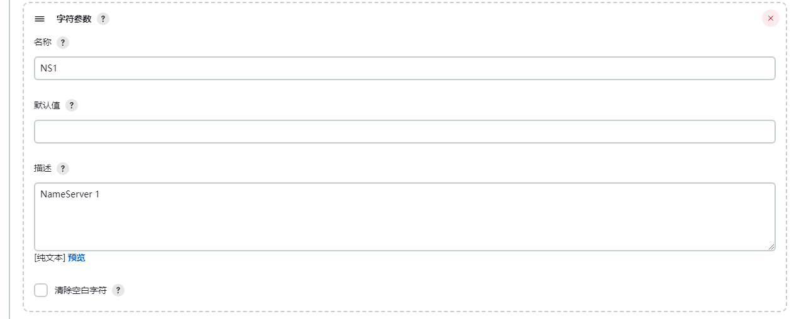

### 1 、Add_CloudFlare_DnsRecords

cloudflare添加dns解析

#### 参数化构建


#### 构建shell

```shell
#!/bin/sh
##set color##
echoRed() { echo $'\e[0;31m'"$1"$'\e[0m'; }
echoGreen() { echo $'\e[0;32m'"$1"$'\e[0m'; }

export CF_API_EMAIL='xxxxxx@gmail.com'
export CF_API_KEY='502dxxxxxxxxxxxxxxxxxxxxxxxx'
#realContent=$(echo $target|awk -F '=' '{print $NF}')

if  [ ! -n "$domains" -o ! -n "$type" -o ! -n "$name" -o ! -n "$target" ] ;then
    echoRed "输入的参数都不能为空，请检查!"
    exit 1
fi

for domain in ${domains};do
	echoGreen "解析的根域名为：--->> $domain"
	echoGreen "解析的类型为：--->> $type"
	echoGreen "解析的名称为：--->> $name"
	echoGreen "解析的目标内容为：--->> $target"
	flarectl dns create --zone="${domain}" --name="${name}" --type="$type" --content="${target}"  	
done
#ping -c 1 -w 1 ${name}.${domain}
```

### 2、Add_CloudFlare_InitDomain

添加域名到cloudflare,并更改NameServer，
状态码返回300说明修改nameserver成功。

#### 参数化构建


#### 构建shell

```shell
##set color##
echoRed() { echo $'\e[0;31m'"$1"$'\e[0m'; }
echoGreen() { echo $'\e[0;32m'"$1"$'\e[0m'; }
#cloudflare
export CF_API_EMAIL='xxxxxxxxxxxxxxxxx'
export CF_API_KEY='xxxxxxxxxxxxxxxxxxxxx'
accountId='xxxxxxxxxxxxxxxxxxxxxxxxxxxx'

if  [ ! -n "$domains" -o ! -n "$account" ] ;then
    echoRed "输入的参数都不能为空,请检查!"
    exit 1
fi

#namesile
apiKey=$(echo $account|awk -F "=" '{print $NF}')

declare num=0

for domain in ${domains}; do
			let num=$num+1
            echoGreen "第${num}条"
			echoGreen "===================================【CloudFlare添加$domain开始】==================================="
            echo -e "\n"
            #判断cloudflare是否已经添加过域名。没有添加过会添加域名到cloudflare。
            if [ $(flarectl zone info --zone=${domain}|grep ${domain}|wc -l) -eq 0 ]; then flarectl zone create --account-id=${accountId} --zone=${domain} --jumpstart=true;fi
			echoGreen "===================================【NameSilo修改$domain NameServer开始】==================================="
			#获取nameserver
            flarectl zone info --zone=${domain}
			NS1=$(flarectl zone info --zone=${domain}|awk -F '|' '{print $5}'|egrep -v "^$|NAME"|sed 's/,//g'|awk '{gsub(/^\s+|\s+$/, "");print}'|head -n1)
			NS2=$(flarectl zone info --zone=${domain}|awk -F '|' '{print $5}'|egrep -v "^$|NAME"|sed 's/,//g'|awk '{gsub(/^\s+|\s+$/, "");print}'|tail -n1)
            #修改nameserver
			curl -s "https://www.namesilo.com/api/changeNameServers?version=1&type=xml&key=${apiKey=}&domain=${domain}&ns1=${NS1}&ns2=${NS2}"
            if [ ${num} -eq 1 ];then
        		statusNum=$(grep '>300<' $JENKINS_HOME/jobs/$JOB_NAME/builds/$BUILD_NUMBER/log|grep -v grep|wc -l)
            	if [ ${statusNum} -eq 0 ];then echoRed "修改name server失败,换个账号试试！" && exit 1;fi
            fi
done
statusAllNum=$(grep '>300<' $JENKINS_HOME/jobs/$JOB_NAME/builds/$BUILD_NUMBER/log|grep code|wc -l)
echoGreen "======>> 总共有${statusAllNum}条域名添加成功！"
```

### 3、Change_NameSilo_NameServer

修改nameliso 域名的NameServer

#### 参数化构建




#### 构建shell

```shell
##set color##
echoRed() { echo $'\e[0;31m'"$1"$'\e[0m'; }
echoGreen() { echo $'\e[0;32m'"$1"$'\e[0m'; }

echoGreen $rootDomains
echoGreen $NS1
echoGreen $NS2
apiKey=$(echo $account|awk -F "=" '{print $NF}')
if  [ ! -n "$rootDomains" -o ! -n "$NS1" -o ! -n "$NS2" ] ;then
    echoRed “输入的3个参数都不能为空，请检查！”
    exit 1
fi

for domain in $rootDomains; do
    echoGreen " ==========修改 ${domain} NameServer开始=========="
    curl -s "https://www.namesilo.com/api/changeNameServers?version=1&type=xml&key=${apiKey=}&domain=${domain}&ns1=${NS1}&ns2=${NS2}"
    echoGreen " ==========修改 ${domain} NameServer结束=========="
done
```

### 4、Delete_CloudFlare_DnsRecords

删除 cloudflare dns解析。

#### 参数化构建


#### 构建shell

```shell
##set color##
echoRed() { echo $'\e[0;31m'"$1"$'\e[0m'; }
echoGreen() { echo $'\e[0;32m'"$1"$'\e[0m'; }

export CF_API_EMAIL='xxxxxx@gmail.com'
export CF_API_KEY='502da1xxxxxxxxxxx4261f752bss8'
echoGreen "解析的根域名为：---》 $domain"
echoGreen "解析的类型为：---》 $type"
echoGreen "解析的名称为：---》 $name"
echoGreen "解析的名称为：---》 $content"
#realContent=$(echo $target|awk -F '=' '{print $NF}')
#echoGreen "解析的内容为：---》 $realContent"

if  [ ! -n "$domains" -o ! -n "$type" -o ! -n "$searchInfo" ] ;then
    echoRed "输入的参数都不能为空，请检查！"
    exit 1
fi

for domain in ${domains};do
		#获取dns记录ID
		id=$(flarectl dns list --zone="${domain}"|grep ${searchInfo}|awk '{print $1}')
		echoGreen $id
		#delete
		flarectl dns delete --zone="${domain}" --id=$id
done
```

### 5、Query_CloudFlare_Info

查询cloudflare 域名信息。

#### 参数化构建

#### 	构建shell

```shell
#!/bin/sh -x
export CF_API_EMAIL='xxxxxz@gmail.com'
export CF_API_KEY='xxxxxxxxxxxxxxxxxxxxxxxxx'
echoRed() { echo $'\e[0;31m'"$1"$'\e[0m'; }
echoGreen() { echo $'\e[0;32m'"$1"$'\e[0m'; }

if  [ ! -n "$domains" -o ! -n "$type" ] ;then
    echoRed “输入的4个参数都不能为空，请检查！”
    exit 1
fi

declare num=0
for domain in $domains;
do
	let num=$num+1
    echoGreen "第${num}条！"
	echoGreen "==================================================【分割线】=================================================="
	if [ "$type" == "DNS" ];then
    	flarectl dns list --zone="$domain"
    elif [ "$type" == "NameServer" ];then
		flarectl zone info --zone="$domain"
    fi
done

```

### 6、Query_NameSile_Domain_Info

查询namesilo域名信息

#### 参数化构建


#### 构建shell

```shell
##set color##
echoRed() { echo $'\e[0;31m'"$1"$'\e[0m'; }
echoGreen() { echo $'\e[0;32m'"$1"$'\e[0m'; }

if  [ ! -n "$domains" or ! -n "$account"] ;then
    echoRed “输入的参数不能为空，请检查！”
    exit 1
fi

echo ${WORKSPACE}

#namesile
apiKey=$(echo $account|awk -F "=" '{print $NF}')

for domain in ${domains}; do
			echoGreen "=================================分割线================================="
			curl -s "https://www.namesilo.com/api/getDomainInfo?version=1&type=xml&key=${apiKey=}&domain=${domain}" > ${WORKSPACE}/dominInfo.xml
            echoGreen "--------------> ${domain} 信息如下 <--------------"
            python3 ${WORKSPACE}/xml2json.py && jq .namesilo.reply ${WORKSPACE}/dominInfo.json |jq 'del(.contact_ids)'
            statusNum=$(grep '>300<' ${WORKSPACE}/dominInfo.xml|grep -v grep|wc -l)
            if [ ${statusNum} -eq 0 ];then echoRed "查询失败,换个账号试试！" && exit 1;fi
done
```

### 7、Update_CloudFlare_DnsRecords

更改 cloudflare dns解析。

#### 构建化参数


#### 构建shell

```shell
##set color##
echoRed() { echo $'\e[0;31m'"$1"$'\e[0m'; }
echoGreen() { echo $'\e[0;32m'"$1"$'\e[0m'; }

export CF_API_EMAIL='xxxxxxxxxxxxx'
export CF_API_KEY='xxxxxxxxxxxxxxxxxxxxxxxxxx'
echoGreen "解析的根域名为：---》 $domain"
echoGreen "解析的类型为：---》 $type"
echoGreen "解析的名称为：---》 $name"
echoGreen "解析的名称为：---》 $content"
#realContent=$(echo $target|awk -F '=' '{print $NF}')
#echoGreen "解析的内容为：---》 $realContent"
declare num=0

if  [ ! -n "$domains" -o ! -n "$type" ] ;then
    echoRed "输入的参数都不能为空，请检查！"
    exit 1
fi

if [ $newContent ] && [ $newName ];then echoRed "输入的参数不能同时存在，请检查！" && exit 1;fi
if [ ! $newContent ] && [ ! $newName ];then echoRed "输入的参数不能同时为空，请检查！" && exit 1;fi

for domain in ${domains};do
	let num=$num+1
    echoGreen "第${num}条！"
	if [ $newName ] && [ ! $newContent ];then
    	echoRed "-----------------------start---------------------"
		id=$(flarectl dns list --zone="${domain}"|grep ${searchKey}|awk '{print $1}')
        if [ $id ];then 
        	echoGreen $id
            flarectl dns update --zone="${domain}" --id=$id --type="${type}" --name="${newName}"
        else 
            echoRed "dns id null"
            continue
        fi
        echoRed "-----------------------end---------------------"
    fi
    
    if [ $newContent ] && [ ! $name ];then
        echoRed "-----------------------start---------------------"
        id=$(flarectl dns list --zone="${domain}"|grep ${searchKey}|awk '{print $1}')
        if [[ -n $id ]];then 
        	for i in $id;do flarectl dns update --zone="${domain}" --id=$i --type="${type}" --content="${newContent}";done
        else 
            echoRed "${domain} dns id null"
            continue
        fi
        echoRed "-----------------------end---------------------"
    fi
done
echoRed "--------------------以下域名的dns记录未更新成功！---------------------"
#显示没有更新成功的dns域名
grep null $JENKINS_HOME/jobs/$JOB_NAME/builds/$BUILD_NUMBER/log|grep -v "echo"
```

