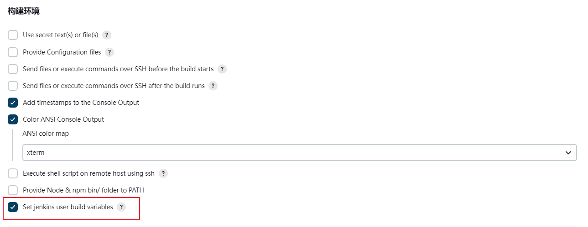
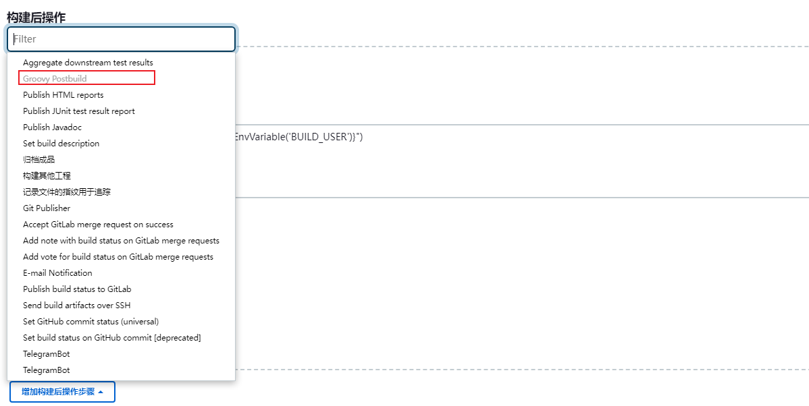
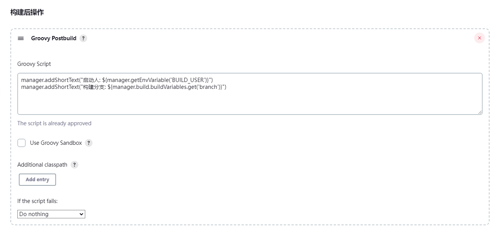
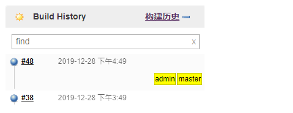
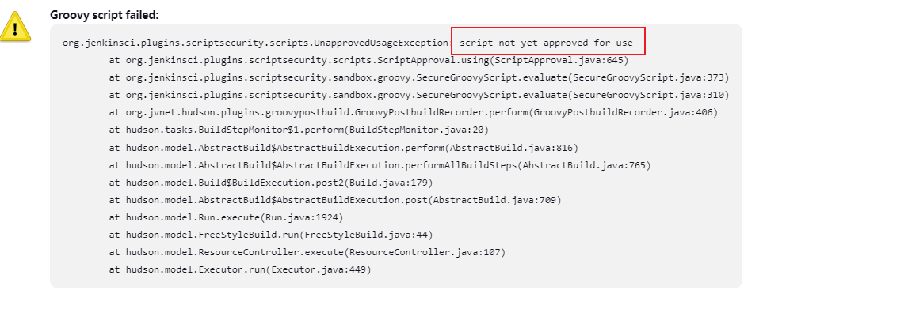
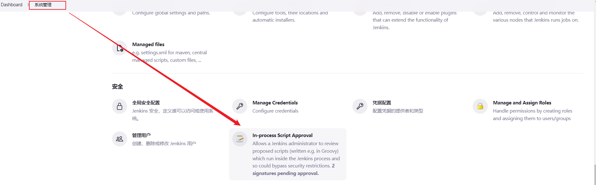
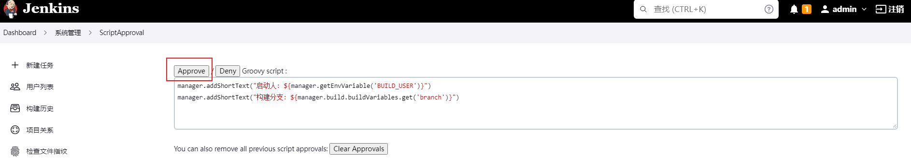

#### 1 跳过错误返回

```
        set +e
        ssh -p $sshPort root@$IP "grep -rni $domain /etc/nginx/conf.d"
        true
```

#### 2 shell脚本不输出调试信息

```
#!/bin/sh -e
```


#### 3 jenkins构建日志位置

```
$JENKINS_HOME/jobs/$JOB_NAME/builds/$BUILD_NUMBER/log
```

https://www.cnblogs.com/kaerxifa/p/16037993.html


#### 4 Jenkins在历史中展示构建者和分支名

##### 4.1 安装两个插件

1. user build vars plugin

2. Groovy Postbuild

##### 4.2 项目配置

###### （1）配置“构建环境”

安装完毕后需要在新建项目配置中，勾选 “Set [jenkins](https://so.csdn.net/so/search?q=jenkins&spm=1001.2101.3001.7020) user build variables” 选项，
要安装“user build vars plugin”插件才会出现该选项。



勾选这个选项后，在构建过程中会增加当前登录用户的如下信息到环境变量中，可以通过Groovy脚本获取这些变量值。变量名如下：

```shell
BUILD_USER             全名
BUILD_USER_FIRST_NAME  名字
BUILD_USER_LAST_NAME   姓
BUILD_USER_ID          jinkins用户ID
BUILD_USER_EMAIL       用户邮箱
```

###### （2）配置“构建后操作”

增加“Groovy Postbuild”



###### （3）编写“Groovy Postbuild”脚本



```groovy
manager.addShortText(manager.getEnvVariable("BUILD_USER"))
manager.addShortText(manager.build.buildVariables.get("branch"))
```

增加中文注释：

```groovy
manager.addShortText("启动人: ${manager.getEnvVariable('BUILD_USER')}")
manager.addShortText("构建分支: ${manager.build.buildVariables.get('branch')}")
```

1. manager.addShortText() 函数用于在构建历史中添加额外的展示信息。
2. manager.getEnvVariable("BUILD_USER") 函数用于获取环境变量“BUILD_USER”，这个环境变量是“user build vars plugin”插件设置进去的（需要勾选“Set jenkins user build variables”）。
3. manager.build.buildVariables.get("branch") 函数用于获取“构建参数branch"的值，如果你配置了“参数化构建”，通过这个函数可以获取构建时传入的参数


##### 4.3 查看构建历史

构建完毕后，历史构建增加两个信息：admin和master



##### 4.4 遇到的问题





如果清除了approvals，需要重启jenkins



##### 4.5 参考文档

https://blog.csdn.net/iteye_19045/article/details/103746680


#### 5 日志输出

https://www.qiniu.com/qfans/qnso-34466477

http://www.gongstring.com/1275633581168836610.html

https://blog.51cto.com/u_12204/7501534
