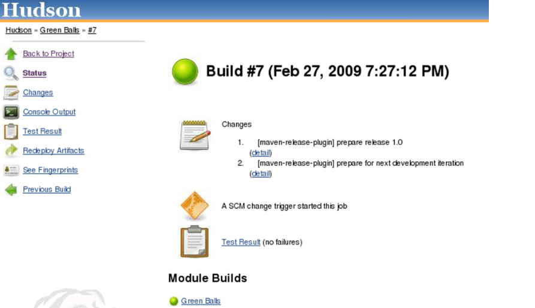

## 1. Blue Ocean

Blue Ocean 这个名字确实美好、宁静。我们先来看看 Jenkins（也是创作公司）是[如何介绍的](https://wiki.jenkins.io/pages/viewpage.action?pageId=98403475)：“再一次颠覆 Jenkins 的用户体验”，“减少混乱，让团队合作分工明了、秩序井然”。从功能上来说， Blue Ocean 会进行适当的清理。毕竟，Jenkins 也是持续集成领域的“古董级”产品了，确实需要一些“UI 清理”

插件链接：https://plugins.jenkins.io/blueocean

## 2. Git

如果使用 Subversion 或 CVS，则不需要安装插件， 但是如果使用 Git 作为版本控制工具或源代码管理系统，则应该使用 Git 插件。这个插件集成了 Git 和 Jenkins，支持 Jenkins 项目中的 Git 功能，比如 pull、fetch、checkout、branch、list、merge、tag 和 push repositories。

插件链接：https://plugins.jenkins.io/git/


## 3. Build Pipeline

在 Jenkins 上管理工作的难度并不小，不过，Build Pipeline 插件可以帮上忙。

Build Pipeline 插件是一个可视化工具，用于查看构建进程及管道中的所有作业和依赖项，提供“上游和下游作业连接的视图”。此外，通过添加手动触发器，这个插件可以设定手动操作步骤，例如，Jenkins之外的进程、部署前的审查流程。

插件链接：https://plugins.jenkins.io/build-pipeline-plugin


## 4. Maven

关于 Maven 的讨论层出不穷，不得不说，“软件红是非多”。虽然 Maven 已是 Jenkins 中开箱即用的功能，但这个插件依然有不小的市场。 插件版本具有更多的功能，比如自动配置报告插件（Junit、Findbugs 等）、发布或使用的  SNAPSHOT 自动触发作业、增量构建、并行构建，以及项目成功并通过所有测试后的二进制文件部署。

插件链接：https://plugins.jenkins.io/maven-plugin


## 7. Green balls

这不是一个 bug ——成功的构建在Jenkins中显示为蓝色。

这个插件很有趣，可以将蓝色的成功构建的颜色变成西方文化中更直观的颜色（与日本文化相反）：绿色。一旦安装，所有成功的构建都会变成绿色。太神了。

插件链接: https://plugins.jenkins.io/greenballs




## 8. Rebuilder

- 官方地址：https://plugins.jenkins.io/rebuild
- 安装方式：在Jenkins插件当中直接搜索即可安装。
- 功能说明：此插件可以直接重复上次构建，也可以用于查看一些参数比较复杂的构建时，上次构建所选的参数是什么。非常nice的一个插件。

## 9，AnsiColor。

- 官方地址：https://plugins.jenkins.io/ansicolor
- 安装方式：在Jenkins插件当中直接搜索即可安装。
- 功能说明：扩展支持我们在shell当中定义的echo -e指令，从而给一定的输出上颜色。
- 使用方式：[点此跳转到使用介绍。(opens new window)](http://blog.eryajf.net/1786.html)

## 10，user build vars。

- 官方地址：https://wiki.jenkins.io/display/JENKINS/Build+User+Vars+Plugin
- 安装方式：在Jenkins插件当中直接搜索即可安装。
- 功能说明：通过此插件，让整个Jenkins系统中的用户参数成为一个可调用的变量。
- 使用方式：在构建环境中选中Set Jenkins user build variables。


## 11，Active Choices Plugin

- 官方地址：https://wiki.jenkins.io/display/JENKINS/Active+Choices+Plugin

- 安装方式：在Jenkins插件当中直接搜索即可安装。

- 功能说明：根据所选参数，自动调出对应参数所依赖的后续参数。

- 使用方式：[点此跳转到使用介绍。(opens new window)](http://blog.eryajf.net/2075.html)

  [使用Active-Choices-Plugin插件将十个Job合成一个](https://www.jenkins-zh.cn/wechat/articles/2019/06/2019-06-26-using-active-choices-plugin-merge-jobs/)
  
  https://blog.csdn.net/TOBEALISTENNER/article/details/109071609

## 12，build-name-setter

- 官方地址：http://wiki.jenkins.io/display/JENKINS/Build+Name+Setter+Plugin

- 安装方式：在Jenkins插件当中直接搜索即可安装。

- 功能说明：通过这个插件，可以动态更改项目构建的名称。不要小瞧这个功能，有时候合理应用对于工作的效率提升，可是非常高的。比如，常用的钉钉插件推送的信息过于简单，有一些信息无法从中得知，其实它推送的就是项目构建的名称，这个时候我们可以通过更改项目名称，来直接将一些构建的变量进行传递。

- 使用方式：[可以通过这样一个妙用示例对其进行理解。(opens new window)](http://blog.eryajf.net/2274.html)

  

## 13，Email Extension Template

- 官方地址：https://wiki.jenkins.io/display/JENKINS/Email-ext+plugin
- 安装方式：在Jenkins插件当中直接搜索即可安装。
- 功能说明：Jenkins部署状态邮件通知插件。
- 使用方式：[可以通过这样一个妙用示例对其进行理解。](http://blog.eryajf.net/350.html)


## 14，description setter

- 官方地址：https://wiki.jenkins.io/display/JENKINS/Description+Setter+Plugin
- 安装方式：在Jenkins插件当中直接搜索即可安装。
- 功能说明：可以在构建名称下，定义一些描述信息的插件，也是非常好用的插件。
- 使用方式：[可以通过这样一个妙用示例对其进行理解](http://blog.eryajf.net/2274.html)

## 15，Git Parameter

- 官方地址：http://wiki.jenkins-ci.org/display/JENKINS/Git+Parameter+Plugin
- 安装方式：在Jenkins插件当中直接搜索即可安装。
- 功能说明：在参数化构建步骤当中，可添加Git的branch或者tag来作为参数进行构建。
- 使用方式：[可以通过这样一个妙用示例对其进行理解](http://blog.eryajf.net/1676.html)


## 16，Role-Based Strategy

- 官方地址：https://wiki.jenkins.io/display/JENKINS/Role+Strategy+Plugin
- 安装方式：在Jenkins插件当中直接搜索即可安装。
- 功能说明：生产当中常用的Jenkins用户视图权限管理插件。
- 使用方式：[可以通过这样一个妙用示例对其进行理解](http://blog.eryajf.net/1445.html)


## 17，Job Configuration History Plugin

- 官方地址：https://wiki.jenkins.io/display/JENKINS/JobConfigHistory+Plugin

- 安装方式：在Jenkins插件当中直接搜索即可安装。

- 功能说明：jenkins配置当中的后悔药，如果你更改了某个配置，但是现在又想更改回去，没有备份而且忘了，那么可以使用这个插件。

- 使用方式：提供有diff对比功能，以及回滚功能。

  非常友好的配置更改历史记录：


## 18，Simple Theme

- 官方地址：http://afonsof.com/jenkins-material-theme/?tdsourcetag=s_pctim_aiomsg

- 安装方式：在Jenkins插件当中直接搜索即可安装。

- 功能说明：可以自定义Jenkins主题的插件。

- 使用方式：使用方式见官方网站的说明，配置起来非常简单。

  

## 19，Build Trigger Badge

- 官方地址：https://wiki.jenkins-ci.org/display/JENKINS/Build+Trigger+Badge+Plugin

- 安装方式：在Jenkins插件当中直接搜索即可安装。

- 功能说明：能够在项目视图首页展示项目构建人的插件。

- 使用方式：事实上这个功能之前我已经在可以通过这样一个妙用示例对其进行理解这篇文章里通过智慧使用其他方式实现了，只不过现在这个插件可以直接实现对应的功能。如果首页视图当中看不到，可以通过编辑视图，添加cause即可看到。

  

## 20，Console Column Plugin

- 官方地址：https://wiki.jenkins.io/display/JENKINS/Console+Column+Plugin

- 安装方式：在Jenkins插件当中直接搜索即可安装。

- 功能说明：能够在项目视图首页展示项目构建输出面板的地址。

- 使用方式：首页视图中，可以通过`编辑视图`，添加`Last Console`即可看到

  

## 21，Display Console Output Plugin

- 官方地址：https://plugins.jenkins.io/display-console-output
- 安装方式：在Jenkins插件当中直接搜索即可安装。
- 功能说明：点击项目构建之后，可以直接在当前窗口显示构建日志。
- 使用方式：安装之后默认启用，随便点击一个自由风格的项目构建即可看到效果。


## 22，Version Number

- 官方地址：https://plugins.jenkins.io/versionnumber/
- 安装方式：在Jenkins插件当中直接搜索即可安装。
- 功能说明：通过插件的方式提供更加丰富的构建版本号
- 使用方式：安装之后默认启用，随便点击一个自由风格的项目构建即可看到效果。

## 23，figlet-buildstep

- 官方地址：https://plugins.jenkins.io/figlet-buildstep/
- 安装方式：在Jenkins插件当中直接搜索即可安装。
- 功能说明：这个插件允许你在构建过程中输出一个简单的横幅。
- 使用方式：使用方法我们可以在流水线语法中直接获取：


```
figlet '"start build"'
```


## 24，Hidden Parameter plugin

- 官方地址：[https://plugins.jenkins.io/hidden-parameter(opens new window)](https://plugins.jenkins.io/hidden-parameter)
- 安装方式：在Jenkins插件当中直接搜索即可安装。
- 功能说明：提供了一个隐藏参数项的功能，即可以添加一个参数，而并不会在构建页面显示。这种适用于一些不必展示的参数，使用接口调用构建时，也能通过调整该参数进行自定义构建。
- 使用方式


如果是pipeline风格，则可通过如下方式进行定义，如下定义方式，我搜遍了全网，没有遇到直接给出定义方法的案例，看到这里，独此一家：

```
//分支代码对应
def ChoiseEnv() {
    return [
        [$class: 'WHideParameterDefinition', name: 'COMMID', defaultValue: '666',description:'提交ID']
    ]
}

properties([
    parameters(ChoiseEnv())
])

pipeline {
    agent any
    environment {
        // 服务名称
        SERVICE_NAME="${JOB_BASE_NAME}"
        MODE="DEPLOY"
        REASON="无"
        REMOTE_HOST="占位"
        _VERSION="测试验证"
        ROBOT_KEY="6a781aaf-0cda-41ab-9bd2-ed81ee7fc7"
        // 主项目地址
        GIT_URL = "https://gitlab.eryajf.net/ops/test.git"
    }
    parameters {
        string(name: 'BRANCH', defaultValue: 'master', description: '请输入将要构建的代码分支')
    }
    options {
        timestamps() // 输出构建日志打印时间信息
        timeout(time: 10, unit: 'MINUTES') // 设置构建超时时间
        buildDiscarder(logRotator(numToKeepStr: '15')) // 设置历史构建保留次数
        gitLabConnection('gitlab-token') // 操作gitlab的token
    }
    triggers{
        gitlab(triggerOnPush: false,triggerOnMergeRequest: true,branchFilterType: 'All',secretToken: "${env.GIT_TOKEN}") // 预留Gitlab提交自动构建
    }
    stages {
        stage('拉取代码') {
            steps {
                script {
                    try {
                        checkout(
                            [$class: 'GitSCM', doGenerateSubmoduleConfigurations: false, submoduleCfg: [], extensions: [[$class: 'CloneOption', depth: 1, noTags: false, reference: '', shallow: true]],
                            branches: [[name: "$BRANCH"]],userRemoteConfigs: [[url: "${env.GIT_URL}", credentialsId: "cicd-pass"]]]
                        )
                        // 定义全局变量
                        env.COMMIT_ID   = sh(script: 'git log --pretty=format:%h',  returnStdout: true).trim() // 提交ID
                        env.COMMIT_USER = sh(script: 'git log --pretty=format:%an', returnStdout: true).trim() // 提交者
                        env.COMMIT_TIME = sh(script: 'git log --pretty=format:%ai', returnStdout: true).trim() // 提交时间
                        env.COMMIT_INFO = sh(script: 'git log --pretty=format:%s',  returnStdout: true).trim() // 提交信息
                    }catch(exc) {
                        env.REASON = "拉取代码出错"
                        throw(exc)
                    }
                }
            }
        }

        stage('检测项目') {
            steps {
                script {
                    try {
                        sh '''
                            cat README.md
                            echo ${COMMID}
                        '''
                        sh "printenv"
                    }catch(exc) {
                        env.REASON = "检测项目出错"
                        throw(exc)
                    }
                }
            }
        }
    }

    post {
        always {
            script{
                wrap([$class: 'BuildUser']){
                    buildName "#${BUILD_ID}-${BRANCH}-${BUILD_USER}" // 更改构建名称
                    currentBuild.description = "提交者: ${COMMIT_USER}" // 添加说明信息
                    currentBuild.description += "\n构建主机: ${REMOTE_HOST}" // 添加说明信息
                    currentBuild.description += "\n提交ID: ${COMMIT_ID}" // 添加说明信息
                    currentBuild.description += "\n提交时间: ${COMMIT_TIME}" // 添加说明信息
                    currentBuild.description += "\n提交内容: ${COMMIT_INFO}" // 添加说明信息
                }
                sh "printenv"
            }
            cleanWs()
        }
    }
}

```


## 25，Config File Provider

- 官方地址：https://plugins.jenkins.io/config-file-provider

- 安装方式：在Jenkins插件当中直接搜索即可安装。

- 功能说明：提供全局配置管理的一种优雅方式，通常在pipeline中的一些认证会用到这个配置。

- 使用方式：添加一些诸如k8s认证文件config配置的功能。

  

## 26，extended-choice-parameter

- 官方地址：https://plugins.jenkins.io/extended-choice-parameter

- 安装方式：在Jenkins插件当中直接搜索即可安装。

- 功能说明：提供了一种灵活地参数化能力。回滚使用的这个插件。

- 使用方式：实现回滚版本选项列表的插件

  

## 27，Docker Pipeline

- 官方地址：https://plugins.jenkins.io/docker-workflow
- 安装方式：在Jenkins插件当中直接搜索即可安装。
- 功能说明：提供了pipeline中docker环境隔离的能力。
- 使用方式：使用方式参考[这里](https://wiki.eryajf.net/pages/3298.html#_11-docker)


## 28,  Telegram Bot

## 参考文档

https://wiki.eryajf.net/pages/2280.html#_20-extended-choice-parameter

https://www.jianshu.com/p/d6e9e63716a4

[Jenkins 基础之外——利用“必备”插件](https://www.oomspot.com/post/sjichuzhiwailiyongbibeichajian	)

[jenkins插件安装的几种方式（在线安装、离线安装）](https://www.cnblogs.com/uncleyong/p/16715922.html)