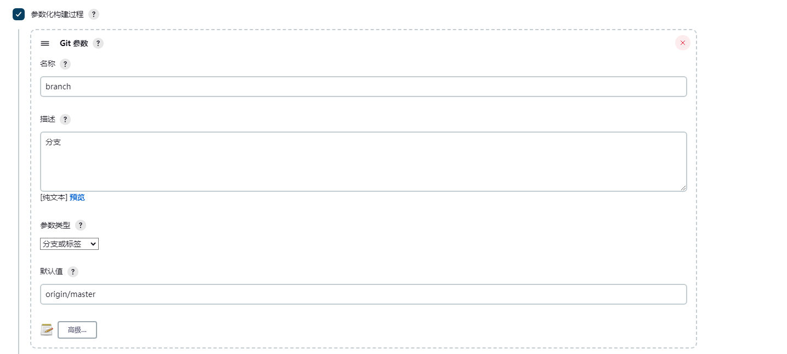
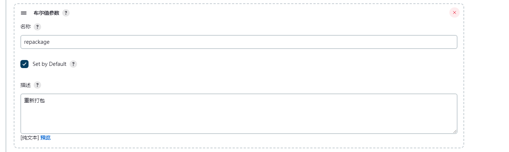
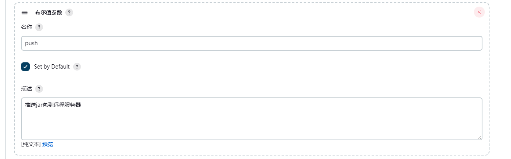
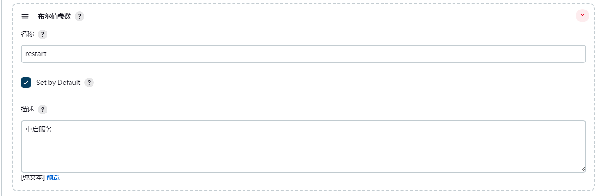
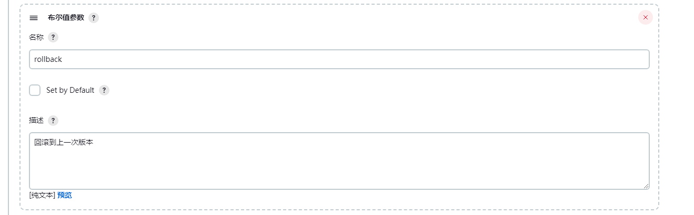
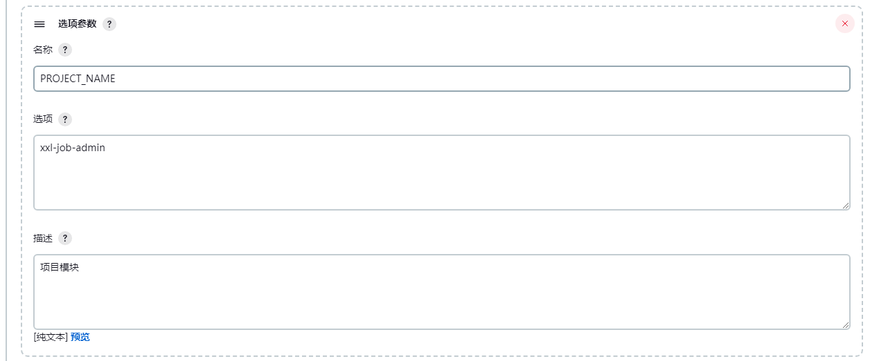
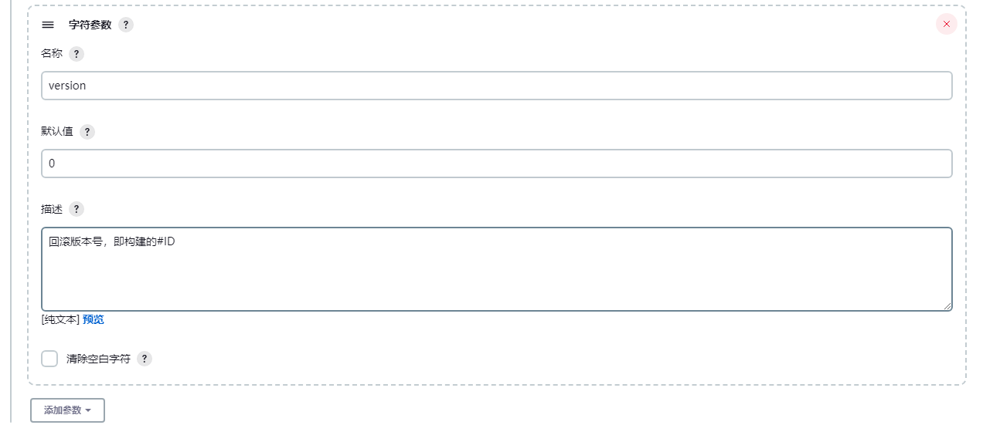

### V1

#### 参数化构建








#### 执行shell

```
#!/bin/bash -lex

# 项目路径 
target_path="${WORKSPACE}/${PROJECT_NAME}/target/"

# 备份路径
back_path="${WORKSPACE}/bak/"

# 当前构建ID的路径
back_path_num="${back_path}${BUILD_NUMBER}"

# 备份路径不存在则创建
if [ ! -d ${back_path_num} ]; then 
    mkdir -p $back_path_num
    echo "$back_path_num 创建成功"
fi

SERVICE_CONFIG_TABLE='
uni-channel-admin;8.217.213.121
'

if $repackage; then
	echo "# --------------------------- 重新打包 start ------------------------------- #"
		/usr/local/maven/bin/mvn clean package
    echo "# --------------------------- 重新打包 end ------------------------------- #"
fi

if $push; then
    echo "# --------------------------- 推送jar包到远程服务器 start ------------------------------- #"
    for SERVICE_CONFIG in $SERVICE_CONFIG_TABLE; do
    	# 遍历获取每一行的服务名：
        SERVICE_NAME=$(echo $SERVICE_CONFIG | cut -f 1 -d ';' )
        SERVER_IP=$(echo $SERVICE_CONFIG | cut -f 2 -d ';' )
        
    	# 如果 项目名 == 服务名，或者 项目名 == all，二者满足一个条件，则执行推送脚本到远程服务器：
        if [[ "$PROJECT_NAME" == "$SERVICE_NAME" || "$PROJECT_NAME" = "all" ]]; then
            echo "备份${SERVICE_NAME}.jar 为 ${SERVICE_NAME}.jar.bak"
            cp -f ${target_path}*.jar ${back_path_num} 
            
            echo "推送到远程服务器"
            scp $SERVICE_NAME/target/${SERVICE_NAME}.jar root@$SERVER_IP:/projects/channel/
    	fi
    done
    echo "# --------------------------- 推送jar包到远程服务器 end ------------------------------- #"
fi

if $restart; then 
	echo "# --------------------------- 重启服务 start ------------------------------- #"
	for SERVICE_CONFIG in $SERVICE_CONFIG_TABLE; do
    	SERVICE_NAME=$(echo $SERVICE_CONFIG | cut -f 1 -d ';' )
        SERVER_IP=$(echo $SERVICE_CONFIG | cut -f 2 -d ';' )
    	
        # 如果 项目名 == 服务名，或者 项目名 == all，二者满足一个条件，则在远程服务器执行重启服务命令：
        if [[ "$PROJECT_NAME" == "$SERVICE_NAME" || "$PROJECT_NAME" = "all" ]]; then
            ssh root@$SERVER_IP "supervisorctl restart $SERVICE_NAME"
            sleep 5s
    	fi
    done
    echo "# --------------------------- 重启服务 end ------------------------------- #"
fi

if $rollback; then
	echo "# --------------------------- 回滚服务 start ------------------------------- #"
	for SERVICE_CONFIG in $SERVICE_CONFIG_TABLE; do
    	SERVICE_NAME=$(echo $SERVICE_CONFIG | cut -f 1 -d ';' )
        SERVER_IP=$(echo $SERVICE_CONFIG | cut -f 2 -d ';' )
    	
        # 如果 项目名 == 服务名，或者 项目名 == all，二者满足一个条件，则在远程服务器执行回滚并重启服务命令：
        if [[ "$PROJECT_NAME" == "$SERVICE_NAME" || "$PROJECT_NAME" = "all" ]]; then
            # 使用旧的备份覆盖现在的Java服务：
            #ssh root@$SERVER_IP "/usr/bin/mv -f /projects/${SERVICE_NAME}.jar.bak /projects/${SERVICE_NAME}.jar"
            scp ${back_path}${version}/${SERVICE_NAME}*.jar root@$SERVER_IP:/projects/${SERVICE_NAME}.jar
            # 重启服务：
            ssh root@$SERVER_IP "supervisorctl restart $SERVICE_NAME"
            sleep 5s
    	fi
    done
    echo "# --------------------------- 回滚服务 end ------------------------------- #"
fi
```


定期删除历史版本

```
# 项目备份不可能无限备份。保留 7 个版本的历史数据。
reserved_num=7  #保留文件数
file_dir=${WORKSPACE}/bak/
date=$(date "+%Y%m%d-%H%M%S")


cd $file_dir   #进入备份目录
for DIR in $(ls -rt);do
        if [ "$(ls -A $DIR)" ]; then
                echo "$DIR is not Empty"
        else
                echo "$DIR is Empty"
                rm -rf $DIR
        fi
done


file_num=$(ls -l | grep '^d' | wc -l)   #当前有几个文件夹，即几个备份

while(( $file_num > $reserved_num ))
do
    old_file=$(ls -rt | head -1)         #获取最旧的那个备份文件夹
    echo  $date "Delete File:"$old_file
    rm -rf "${file_dir}$old_file"
    let "file_num--"
done

ls -l $file_dir
```


### V2

带探测业务端口是否启动成功

```
#!/bin/bash -lex
##set color##
echoRed() { echo $'\e[0;31m'"$1"$'\e[0m'; }
echoGreen() { echo $'\e[0;32m'"$1"$'\e[0m'; }
# 项目路径 
target_path="${WORKSPACE}/${PROJECT_NAME}/target/"

# 备份路径
back_path="${WORKSPACE}/bak/"

# 当前构建ID的路径
back_path_num="${back_path}${BUILD_NUMBER}"

# 备份路径不存在则创建
if [ ! -d ${back_path_num} ]; then 
    mkdir -p $back_path_num
    echo "$back_path_num 创建成功"
fi

SERVICE_CONFIG_TABLE='
kumi-client-api;94.74.125.87
kumi-client-api;94.74.110.131
'
#服务端口
SERVICE_PORT='18088'

# 打包
if $repackage; then
	echoGreen "# --------------------------- 重新打包 start ------------------------------- #"
	/usr/local/maven/bin/mvn clean package
    echoGreen "# --------------------------- 重新打包 end ------------------------------- #"
fi

# 发布
if $Deploy; then 
    echoGreen "# --------------------------- 发布 start ------------------------------- #"
    for SERVICE_CONFIG in $SERVICE_CONFIG_TABLE; do
    	# 遍历获取每一行的服务名：
        SERVICE_NAME=$(echo $SERVICE_CONFIG | cut -f 1 -d ';' )
        SERVER_IP=$(echo $SERVICE_CONFIG | cut -f 2 -d ';' )

        echoGreen "------> 备份"
        cp -f ${target_path}*.jar ${back_path_num} 
            
        echoGreen "------> 推送到远程服务器"
        scp $SERVICE_NAME/target/${SERVICE_NAME}.jar root@$SERVER_IP:/java_projects/
        
        echoGreen "----------> 重启服务"
        ssh root@$SERVER_IP "supervisorctl restart ${SERVICE_NAME} && timeout 120s bash /opt/scripts/isUpOrDown.sh ${SERVICE_PORT}"
    done
    echoGreen "# --------------------------- 发布 end ------------------------------- #"
fi

# 回滚
if $rollback; then
	echoGreen "# --------------------------- 回滚服务 start ------------------------------- #"
	for SERVICE_CONFIG in $SERVICE_CONFIG_TABLE; do
    	SERVICE_NAME=$(echo $SERVICE_CONFIG | cut -f 1 -d ';' )
        SERVER_IP=$(echo $SERVICE_CONFIG | cut -f 2 -d ';' )
    	
        # 如果 项目名 == 服务名，或者 项目名 == all，二者满足一个条件，则在远程服务器执行回滚并重启服务命令：
        if [[ "$PROJECT_NAME" == "$SERVICE_NAME" || "$PROJECT_NAME" = "all" ]]; then
            # 使用旧的备份覆盖现在的Java服务：
            #ssh root@$SERVER_IP "/usr/bin/mv -f /java_projects/${SERVICE_NAME}.jar.bak /java_projects/${SERVICE_NAME}.jar"
            scp ${back_path}${version}/${SERVICE_NAME}*.jar root@$SERVER_IP:/projects/${SERVICE_NAME}.jar
            # 重启服务：
            ssh root@$SERVER_IP "supervisorctl restart $SERVICE_NAME"
            sleep 5s
    	fi
    done
    echoGreen "# --------------------------- 回滚服务 end ------------------------------- #"
fi
```


isUpOrDown.sh

```
#!/bin/bash
appPort=$1
ip=$(ip a|grep inet|grep -v 127.0.0.1|egrep -v "inet6|br-|docker"|awk '{print $2}'|awk -F '/' '{print $1}')
while true;do
  nc  -vz ${ip} ${appPort}
  if [ $? -eq 0 ];then
        echo "successed"
        break
  fi
  sleep 3
done
```


#### 参考文档

https://segmentfault.com/a/1190000039164950