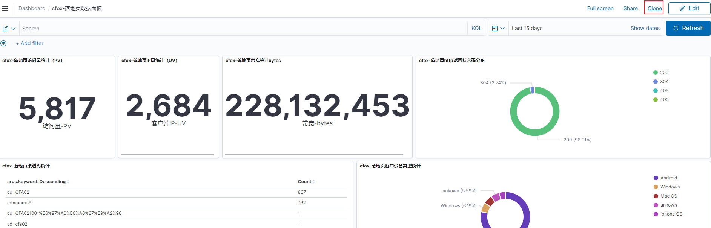

[TOC]


### 一 、新增只读用户

#### 1、admin用户登录

前提：admin用户登录后选择全局global登录并创建相关索引，才能共享。


#### 2、创建只读用户


#### 3、创建角色read_only_index并绑定用户


kibana_user 和 kibana_read_only角色是已有的，不需要创建。直接绑定用户即可


https://opendistro.github.io/for-elasticsearch-docs/docs/security/access-control/users-roles/#set-up-a-read-only-user-in-kibana


### 二 关于多租户

payments-tenant（租户）  --- payments-roles（角色） ---payments-user（用户） 租户可以一对多个角色，一个角色可以绑定多个用户。

https://www.infoq.cn/article/xyoNvw4j05yetHiw9fhF


### 三 字段类型

在logstash配置文件中增加修字段类型后


在kibana中要删除原来的索引模式并重新建立索引模式


### 四 可视化

#### 1、xxx统计


					

#### 2、落地页访客分布图


#### 3、落地页访问量趋势（PV）


#### 4 、落地页访问量统计（PV）


#### 5、 落地页IP量统计（UV）


#### 6、http返回状态码统计

选择饼图


设置


#### 7、客户访问设备统计（饼图）

同6

#### 8、访问页面uri统计TOP10


##### 排除/的统计


可以看到/不会出现在视图中

#### 9、访问量的客户端IP统计TOP10


http://www.51niux.com/?id=209

https://blog.csdn.net/qq_44930876/article/details/128452586

#### 10 、城市分布统计T10（饼图）

同6


#### 11、城市分布统计T10（垂直条形图）


#### 12 带宽统计


#### 13 Markdown 可视化

##### 13.1 创建一个链接

在 Markdown 中输入如下的文字

```
Have an issue? please post it in [Kibana Github repo](https://github.com/elastic/kibana/issues)
```


**链接加粗**

```
Have an issue? please post it in **[Kibana Github repo](https://github.com/elastic/kibana/issues)**
```


https://elasticstack.blog.csdn.net/article/details/107489737

### 五 导出对象


kiban导出不包含对象模式的文件

### 六、查询

#### 6.1 查询索引模式ID

```
GET .kibana/_search
{
  "_source": ["index-pattern.title"],
  "query": {
    "term": {
      "type": "index-pattern"
    }
  }
}
```

https://blog.csdn.net/weixin_42644062/article/details/102876941

#### 6.2 查询可视化视图ID

```
GET .kibana/_search
{
  "_source": ["visualization.title"],
  "query": {
    "term": {
      "type": "visualization"
    }
  }
}
```


```routeros
GET .kibana/_search?q=type:visualization%20AND%20visualization   #查询可视化视图ID
GET .kibana/_search?q=type:index-pattern #查询索引模式ID
```


### 七、可视化视图批量创建

获取索引模式ID

```
 awk -F 'references' '{print $2}' cfx-dl-vis.ndjson |awk -F '"' '{print $5}'|grep -v ^$|uniq
```


获取所有的索引模式及其ID

```
egrep "title|_id" index.json |awk -F '"' '{print $4}'
egrep "title|_id" getindex-par.json |awk -F '"' '{print $4}'
```


可视化一件替换生成新可视化脚本

```shell
#!/bin/bash
#模版每次都初始化
\cp cfx-dl-vis.ndjson.bak cfx-dl-vis.ndjson

#获取模版中的每个可视化ID前8个字符，每个可视化都有各自的ID
visOricodeArr=($(awk -F ',"id":"' '{print $2}' cfx-dl-vis.ndjson |awk -F - '{print $1}'|grep -v '^$'|xargs))

#获取可视化视图ID数组的长度
arrLength=${#visOricodeArr[*]}
arrTruelen=$(expr $arrLength - 1)

#生产新的随机字符串，8个字符串保护数字和小写字母
visNewcodeArr=($(pwgen -ncCA 8 ${arrLength}|xargs))
echo ${visOricodeArr[@]}
echo ${visNewcodeArr[@]}

#获取模版中的索引模式ID
oriIndexId=$(awk -F 'references' '{print $2}' cfx-dl-vis.ndjson |awk -F '"' '{print $5}'|grep -v ^$|uniq)

#将新生成的字符串替换掉模版中的字符串
fun_sed () {
  for i in `seq 0 $arrTruelen`
    do
        #echo $i
        sed -i "s/${visOricodeArr[$i]}/${visNewcodeArr[$i]}/g" cfx-dl-vis.ndjson
    done
}

fun_sed
read -p "请输入要替换的索引模式ID:" indexPatternId
#sed -i "s/e819be80-22cf-11ee-8261-afbc1c670582/$indexPatternId/g" cfx-dl-vis.ndjson
sed -i "s/$oriIndexId/$indexPatternId/g" cfx-dl-vis.ndjson
read -p "请输入可视化视图标题前缀,如cfox-落地页:" titleName
sed -i "s/cfox-落地页/$titleName/g" cfx-dl-vis.ndjson
```


### 八 重新获取索引数据步骤

1. 停止logstash
2. 删除索引 DELETE /logstash-dm-pro-nginx-downloadpage-access-2023.07.17
3. 删除索引模式
4. 开启logstah
5. 重建索引模式


### 九、面板dashboard

#### 7.1 面板克隆




#### 7.2 面板中的panel可以替换


### 十、相关脚本

#### 10.2 查询相关

```shell
curl -s -u admin:qPcKy6wVYZu88hZF -XGET http://10.10.0.57:9200/_cat/indices|awk '{print $3}'|grep -E " *-[0-9]{4}\.[0-1][0-9]\.[0-3][0-9]"
#curl -s -u admin:qPcKy6wVYZu88hZF -X GET http://10.10.0.57:9200/.kibana/_search?q=type:index-pattern

#获取现有es里的索引日期
curl -s -u admin:qPcKy6wVYZu88hZF  http://10.10.0.57:9200/_cat/indices?v |awk -F" " '{print $3}'|grep -vE '^\.|index'|awk -F"-" '{print $NF}'|sort|uniq|sed 's/\./-/g'
```


#### 10.2 定期删除索引

```shell
#!/bin/bash
#description: Clear xx days ago!
##ES日志清理##
source /etc/profile
ES_ip=10.10.0.57
USER=admin
PWD=qPcKy6wVYZu88hZF


#定义删除xx天以前的函数
fun_del_log(){
    #check_day=`date -d '-0 days' '+%F'`
    check_day=$(date -d "-${dayago} days" '+%F')
    index_day=$1
    #将日期转换为时间戳
    checkday_timestamp=`date -d "$check_day" +%s`
    echo 'checkday_timestamp' $checkday_timestamp
    indexday_timestamp=`date -d "$index_day" +%s`
    echo 'indexday_timestamp' $indexday_timestamp
    #当索引的时间戳值小于当前日期xx天前的时间戳时，删除此索引
    if [ ${indexday_timestamp} -lt ${checkday_timestamp} ];then
        #转换日期格式
        format_date=`echo $1 | sed 's/-/\./g'`
        echo $format_date
        curl -s -u ${USER}:${PWD} -XDELETE http://${ES_ip}:9200/*${logtype}*${format_date}
    fi
}

fun_curl () {
    curl -s -u ${USER}:${PWD} http://${ES_ip}:9200/_cat/indices?v |awk -F" " '{print $3}'|grep -vE '^\.|index'|awk -F"-" '{print $NF}'|sort|uniq|sed 's/\./-/g'|while read LINE
    do
        echo "`date +%F_%H-%M-%S` #######"
        fun_del_log $LINE 
   done
}

logTypeArr=(nginx jar)
for logtype in ${logTypeArr[@]}
do
    if [ ${logtype} = "nginx" ];then
        dayago=60
        fun_curl
    elif [ ${logtype} = "jar" ];then
        dayago=6
        fun_curl
    fi
done
```

