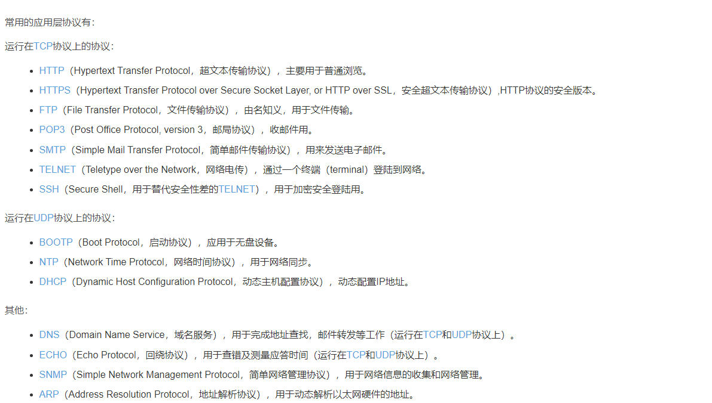
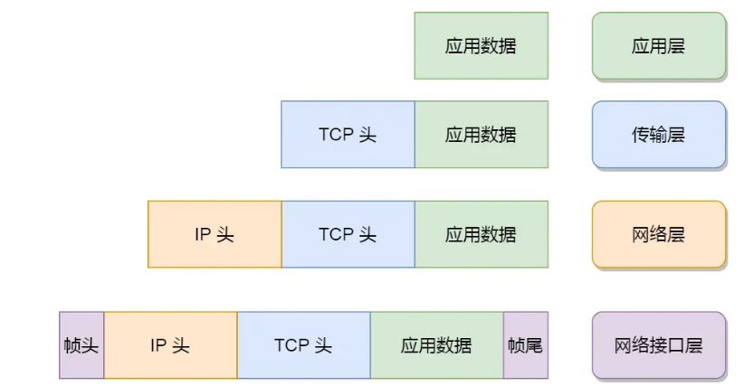
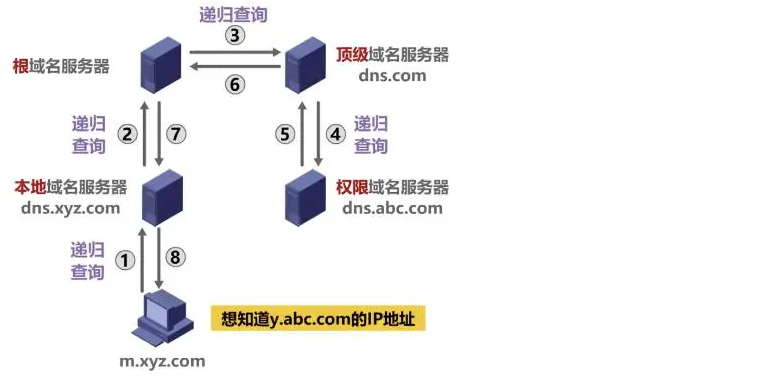
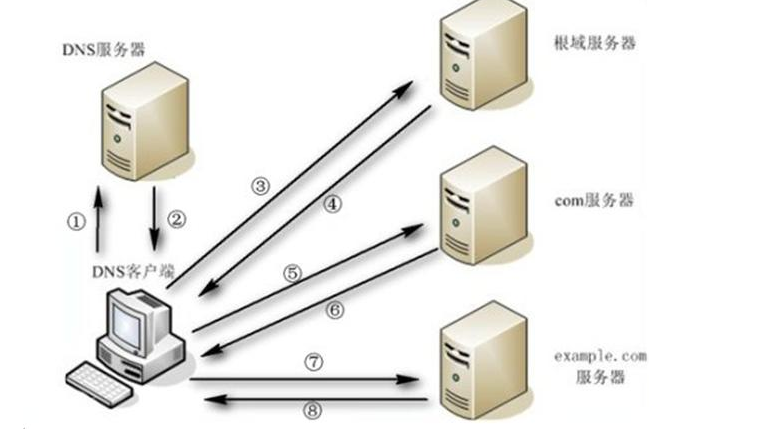
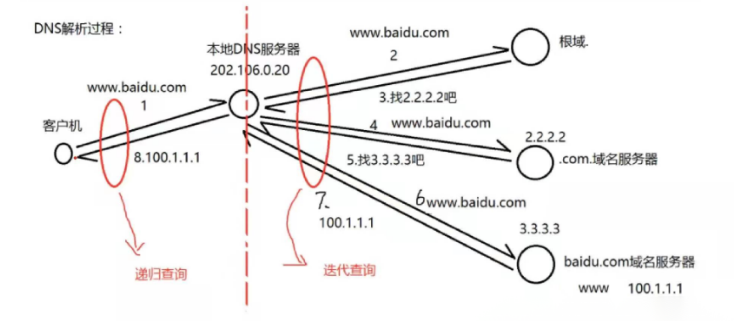

### <font color="#FF3333">系统</font>

#### **把/data目录及其子目录下所有以扩展名.txt结尾的文件中包含oldgirl的字符串全部替换为oldboy**

```shell
find /data/ -type f -name "*.txt" | xargs sed -i 's/oldgirl/oldboy/g'
```

----------------------------------------


### <font color="#FF0000">mysql</font>

#### mysql主从延迟情况

```
1.主库DML语句并发大,从库qps高
2.从库服务器配置差或者一台服务器上几台从库(资源竞争激烈,特别是io)
3.主库和从库的参数配置不一样
4.大事务(DDL,我觉得DDL也相当于一个大事务)
5.从库上在进行备份操作
6.表上无主键的情况(主库利用索引更改数据,备库回放只能用全表扫描,这种情况可以调整slave_rows_search_algorithms参数适当优化下)
7.设置的是延迟备库
8.备库空间不足的情况下

---------
1、需要同步的从库数据太多
2、从库的硬件资源较差，需要提升
3、网络问题，需要提升网络带宽
4、主库的数据写入量较大，需要优配置和硬件资源
5、sql语句执行过长导致，需要优化
```

#### **mysql如何减少主从复制延迟**

```

```

#### 主从数据库不能同步怎么办

```
1、通过跳过错误来继续执行同步，适用于对数据一致性不是那么高的情况下

set global sql_slave_skip_counter =1;

2、重新做主从，完全同步

该方法适用于主从库数据相差较大，或者要求数据完全统一的情况

热备方式修复主从库

操作过程

1）先关闭从数据库

2）记录主库的log_file文件名和位置点

3）导出主库的数据库，拷贝到从库机器上

4）从库删除以前的老库，导进从主库拷贝过来的新库

5）changes主库的Log_file和位置点

6）开启从库
```

#### 请描述MySQL里中文数据乱码原理，如何防止乱码？

```
服务器系统、数据库、客户端三方字符集不一致导致，需要统一字符
```

#### 企业生产MySQL如何优化（请多角度描述）？

```
1、提升服务器硬件资源与网络带宽
2、优化mysql服务配置文件
3、开启慢查询日志然后分析问题所在
```

--------


### <font color="#FF0000">redis</font>

#### Redis两种保存快照的方式是什么？他们有什么区别？

```
 快照模式和AOF模式
   快照模式：将数据保存在内存中，再保存到磁盘中，性能高，但是可能会有少量数据丢失
   AOF模式：性能差，一致性要求高，可以选用这种方法，一般生产环境两种都开
```

----------------


### <font color="#FF0000">MQ</font>

#### 为什么要使用MQ

```
要做到系统解耦，当新的模块进来时，可以做到代码改动最小，能够解耦。
设置流程缓冲池，可以让后端系统按自身 吞吐 能力进行消费，不被冲垮，能够削峰，限流。
强弱依赖梳理能把非关键调用链路的操作异步化并提升整体系统的吞吐能力，能够异步。
MQ 的作用：削峰限流、异步、解耦合
```

------------


### <font color="#FF0000">nginx</font>

#### 综合

```
Q：什么是Nginx？它的主要特点是什么？

A：Nginx是一个高性能的开源Web服务器和反向代理服务器。它以高并发、低内存消耗和高稳定性著称。

Q：Nginx与Apache Web服务器有什么区别？

A：Nginx与Apache相比，更适用于处理高并发和静态内容。它使用异步、事件驱动的架构，占用更少的内存，并能够更好地处理静态文件和反向代理。

Q：如何在Nginx中配置虚拟主机（Virtual Hosts）？

A：可以在Nginx的配置文件中使用server块来定义不同域名或IP的虚拟主机，并配置相应的站点设置和规则。

Q：如何在Nginx中配置负载均衡？

A：可以使用Nginx的upstream模块配置负载均衡。通过定义多个后端服务器和相应的负载均衡算法，Nginx可以将请求分发到不同的后端服务器。

Q：如何实现Nginx的反向代理功能？

A：可以使用Nginx的proxy_pass指令配置反向代理。将请求代理到指定的后端服务器，Nginx作为中间层接收请求，并将响应转发给客户端。

Q：如何在Nginx中配置SSL/TLS加密？

A：可以使用Nginx的ssl_certificate和ssl_certificate_key指令配置SSL/TLS证书和私钥，启用HTTPS安全连接。

Q：如何限制对Nginx服务器的访问？

A：可以使用Nginx的allow和deny指令配置访问控制列表（ACL），限制特定IP地址或IP范围的访问。

Q：如何在Nginx中实现URL重写和重定向？

A：可以使用Nginx的rewrite指令配置URL重写规则，将特定的URL重写为其他URL。可以使用return或rewrite指令实现URL重定向。

Q：如何配置Nginx实现静态文件缓存？

A：可以使用Nginx的expires和add_header指令配置静态文件的缓存策略，控制浏览器缓存文件的时间和缓存头信息。

Q：如何在Nginx中配置HTTP Gzip压缩？

A：可以使用Nginx的gzip指令启用HTTP Gzip压缩，将服务器响应压缩后发送给客户端，减少传输数据量。

Q：什么是Nginx的反向代理和正向代理？它们的区别是什么？

A：Nginx的反向代理是指Nginx作为客户端与后端服务器进行通信，并将请求代理给后端服务器。正向代理是指Nginx作为服务器接收客户端请求，并代理客户端与目标服务器进行通信。区别在于代理的方向和目的。

Q：Nginx支持哪些负载均衡算法？如何配置？

A：Nginx支持的负载均衡算法包括轮询（round-robin）、IP哈希（ip_hash）、最少连接（least_conn）等。可以使用Nginx的upstream模块的load_balance指令来配置负载均衡算法。

Q：如何实现Nginx的日志切割和轮转？

A：可以使用Nginx的logrotate工具，将日志文件进行切割和轮转。可以配置logrotate工具的配置文件，定期执行日志切割操作。

Q：如何在Nginx中配置HTTP请求限速？

A：可以使用Nginx的limit_req指令配置HTTP请求的限速。可以设置请求的速率限制和可接受的突发请求的数量。
```

#### **你常用的Nginx模块，用来做什么**

```
rewrite模块，实现重写功能
access模块：来源控制
ssl模块：安全加密
ngx_http_gzip_module：网络传输压缩模块
ngx_http_proxy_module 模块实现代理
ngx_http_upstream_module模块实现定义后端服务器列表
ngx_cache_purge实现缓存清除功能
```

#### **请列出你了解的web服务器负载架构**

```
Nginx
haproxy
keepalived
lvs
```

#### nginx 优化


```
二进制文件权限 755
关闭标识 server_tokens off;
设置timeout
设置缓冲区
日志配置
日志切割
限制访问ip
限制仅允许域名访问
错误页面重定向
限制并发和速度
补丁更新
配置正向代理模块
防止目录遍历
服务监控 nginx_status
开启高效文件传输 sendfile on
限制文件上传大小
单个进程允许的客户端连接数
nginx worker允许打开的最大文件描述符
开启压缩

-----
工作进程绑定，
最大上传文件大小，
事件驱动模型优化，
文件描述符优化，
防盗链优化，
隐藏软件名称和版本号，
对于404、502等默认页面的优化，
从而对用户友好展示，
禁止恶意域名解析，
禁止通过IP地址访问网站，
严格设置web站点目录的权限，
通过robot协议以及HTTP_USER_AGENT防爬虫优化。
防止ddos单ip并发连接的控制。
status监控模块得开启等等。
limit_rate限制上传速率。
client_max_body_size允许用户上传的文件最大大小。
```

#### 什么是反向代理，什么是正向代理，区别是什么？

```
反向代理和正向代理都是代理服务器的一种应用形式，它们的主要区别在于代理的方向和代理对象不同。

正向代理是在客户端和目标服务器之间设置代理服务器，以代替客户端向目标服务器发送请求，客户端无法直接访问目标服务器。正向代理服务器一般用于加密、缓存、控制访问、内容过滤等功能。例如，翻墙工具就是一种常见的正向代理应用。

反向代理是在目标服务器和客户端之间设置代理服务器，以代替目标服务器向客户端提供服务，客户端无法直接访问目标服务器，所有的请求都要经过反向代理服务器。反向代理服务器可以根据客户端的请求选择不同的目标服务器，从而实现负载均衡和高可用性。例如，一些大型网站和应用程序就会使用反向代理服务器进行负载均衡和缓存。

两者的主要区别在于代理的方向不同。正向代理是代理客户端，把客户端的请求转发到目标服务器；而反向代理是代理服务器端，把目标服务器的响应转发给客户端。
```


-------------


### <font color="#FF0000">安全</font>

#### Linux系统中病毒怎么解决

```
找到病毒文件然后删除；中毒之后一般机器cpu、内存使用率会比较高，机器向外发包等异常情况，排查方法：

linux服务器流量剧增,用iftop查看有连接外网的情况。netstat连接的外网ip和端口。
#top命令找到cpu使用率高的进程，一般病毒文件命名都比较乱
#可以用ps aux 查看是否有不明进程，找出病毒文件的位置
#rm -f 命令删除病毒文件
#检查计划任务、开机启动项和病毒文件目录有无其他可疑文件等

chkconfig    --list     |  grep  3:on

服务器启动级别是3的，检查一下了开机启动项，没有特别明显的服务。然后检查了一下开机启动的一个文件，more   /etc/rc.local
```

-------------


### <font color="#FF0000">网络</font>

#### 七层模型


```
应用层 (Application)：
网络服务与最终用户的一个接口。
协议有：HTTP FTP TFTP SMTP SNMP DNS TELNET HTTPS POP3 DHCP

表示层（Presentation Layer）：
数据的表示、安全、压缩。（在五层模型里面已经合并到了应用层）
格式有，JPEG、ASCll、DECOIC、加密格式等

会话层（Session Layer）：
建立、管理、终止会话。（在五层模型里面已经合并到了应用层）
对应主机进程，指本地主机与远程主机正在进行的会话

传输层 (Transport)：
定义传输数据的协议端口号，以及流控和差错校验。
协议有：TCP UDP，数据包一旦离开网卡即进入网络传输层

网络层 (Network)：
进行逻辑地址寻址，实现不同网络之间的路径选择。
协议有：ICMP IGMP IP（IPV4 IPV6） ARP RARP

数据链路层 (Link)：
建立逻辑连接、进行硬件地址寻址、差错校验等功能。（由底层网络定义协议）
将比特组合成字节进而组合成帧，用MAC地址访问介质，错误发现但不能纠正。

物理层（Physical Layer）：
```

```
应用层：为应用程序提供网络服务。
表示层：对数据进行格式化、编码、加密、压缩等操作
会话层：建立、维护、管理会话连接
传输层：建立、维护、管理端到端的连接，常见的有 TCP/UDP
网络层：IP 寻址和路由选择
数据链路层：控制网络层与物理层之间的通信
物理层：比特流传输
```

因特网协议栈中的层
人们已经进行一些讨论关于如何将TCP/IP参考模型映射到OSI模型。由于TCP/IP和OSI模型组不能精确地匹配，还没有一个完全正确的答案。下面的图表试图显示不同的TCP/IP和其他的协议在最初OSI模型中的位置：

 



#### TCP/IP模型

https://tonydeng.github.io/sdn-handbook/basic/tcpip.html

https://blog.csdn.net/jiangyu1013/article/details/79920552

##### 每一层的封装格式



网络接口层的传输单位是帧（frame），IP 层的传输单位是包（packet），TCP 层的传输单位是段（segment），HTTP 的传输单位则是消息或报文（message）。但这些名词并没有什么本质的区分，可以统称为数据包

#### tcp三次握手

```
https://xiaolincoding.com/network/3_tcp/tcp_interview.html#tcp-%E4%B8%89%E6%AC%A1%E6%8F%A1%E6%89%8B%E8%BF%87%E7%A8%8B%E6%98%AF%E6%80%8E%E6%A0%B7%E7%9A%84
```

#### websocket和http的区别

```
websocket和http的区别有：1、含义不同；2、连接方式不同；3、连接长度不同；4、连接状态不同；5、协议开头不同。其中，含义不同指的是WebSocket是双向通信协议，模拟Socket协议，可以双向发送或接受信息，HTTP是一个简单的请求-响应协议，是单向的。
```

```
两者的区别
相同点：
都是 TCP 协议；
都使用 Request/Response 模型进行连接的建立；
websocket 是基于 http 的，他们的兼容性都很好；
在连接的建立过程中对错误的处理方式相同；
都可以在网络中传输数据。

不同点：
websocket 是持久连接，http 是短连接；
websocket 的协议是以 ws/wss 开头，http 对应的是 http/https；
websocket 是有状态的，http 是无状态的；
websocket 连接之后服务器和客户端可以双向发送数据，http只能是客户端发起一次请求之后，服务器才能返回数据；
websocket 是可以跨域的;
websocket 连接建立之后，数据的传输使用帧来传递，不再需要Request消息。
```


### <font color="#FF0000">docker</font>

#### **docker四种网络模式**

```
1 host模式
众所周知，Docker使用了Linux的Namespaces技术来进行资源隔离，如PID Namespace隔离进程，Mount
Namespace隔离文件系统，Network Namespace隔离网络等。一个Network Namespace提供了一份独立的网络环境，包括网卡、路由、Iptable规则等都与其他的Network Namespace隔离。一个Docker容器一般会分配一个独立的Network
Namespace。但如果启动容器的时候使用host模式，那么这个容器将不会获得一个独立的Network Namespace，而是和宿主机共用一个Network Namespace。容器将不会虚拟出自己的网卡，配置自己的IP等，而是使用宿主机的IP和端口。
例如，我们在10.10.101.105/24的机器上用host模式启动一个含有web应用的Docker容器，监听tcp80端口。当我们在容器中执行任何类似ifconfig命令查看网络环境时，看到的都是宿主机上的信息。而外界访问容器中的应用，则直接使用10.10.101.105:80即可，不用任何NAT转换，就如直接跑在宿主机中一样。但是，容器的其他方面，如文件系统、进程列表等还是和宿主机隔离的。

 2 container模式
在理解了host模式后，这个模式也就好理解了。这个模式指定新创建的容器和已经存在的一个容器共享一个Network
Namespace，而不是和宿主机共享。新创建的容器不会创建自己的网卡，配置自己的IP，而是和一个指定的容器共享IP、端口范围等。同样，两个容器除了网络方面，其他的如文件系统、进程列表等还是隔离的。两个容器的进程可以通过lo网卡设备通信。

 3 none模式
这个模式和前两个不同。在这种模式下，Docker容器拥有自己的Network Namespace，但是，并不为Docker容器进行任何网络配置。也就是说，这个Docker容器没有网卡、IP、路由等信息。需要我们自己为Docker容器添加网卡、配置IP等。

 4 bridge模式
bridge模式是Docker默认的网络设置，此模式会为每一个容器分配Network Namespace、设置IP等，并将一个主机上的Docker容器连接到一个虚拟网桥上。下面着重介绍一下此模式。host模式使用Docker run时使用–net=host指定 Docker使用的网络实际上和宿主机一样，在容器内看到的网卡ip是宿主机上的ip。
docker常用命令
1. docker version  查看docker的版本号，包括客户端、服务端、依赖的Go等
2. docker info  查看系统(docker)层面信息，包括管理的p_w_picpaths, containers数等
3. docker search <p_w_picpath>在docker index中搜索p_w_picpath
4. docker pull <p_w_picpath>从docker registry server 中下拉p_w_picpath
5. docker push <p_w_picpath|repository>推送一个p_w_picpath或repository到registry
6. docker push <p_w_picpath|repository>:TAG  同上，指定tag
7. docker inspect <p_w_picpath|container>查看p_w_picpath或container的底层信息
8. docker p_w_picpaths  查看本机p_w_picpaths
9. docker p_w_picpaths –a  列出所有的p_w_picpaths
10. docker ps默认显示正在运行中的container
```

**docker的工作原理是什么**

```
docker是一个Client-Server结构的系统，docker守护进程运行在宿主机上，守护进程从客户端接受命令并管理运行在主机上的容器，容器是一个运行时环境，这就是我们说的集装箱。

--------
Docker是一个Client-Server结构的系统，Docker守护进程运行在主机上， 然后通过Socket连接从客户端访问Docker守护进程。
Docker守护进程从客户端接受命令，并按照命令，管理运行在主机上的容器。
```

```
容器被称为轻量级的虚拟化技术，实际上是不准确的。确切地说，容器是一种对进程进行隔离的运行环境
```


--------------------


### <font color="#FF0000">高可用</font>

**keepalive的工作原理和如何做到健康检查**

```
keepalived是以VRRP协议为实现基础的，VRRP全称Virtual Router Redundancy Protocol，即虚拟路由冗余协议。
虚拟路由冗余协议，可以认为是实现路由器高可用的协议，即将N台提供相同功能的路由器组成一个路由器组，这个组里面有一个master和多个backup，master上面有一个对外提供服务的vip（该路由器所在局域网内其他机器的默认路由为该vip），master会发组播，当backup收不到vrrp包时就认为master宕掉了，这时就需要根据VRRP的优先级来选举一个backup当master。这样的话就可以保证路由器的高可用了。

keepalived主要有三个模块，分别是core、check和vrrp。core模块为keepalived的核心，负责主进程的启动、维护以及全局配置文件的加载和解析。check负责健康检查，包括常见的各种检查方式。vrrp模块是来实现VRRP协议的。
Keepalived健康检查方式配置
HTTP_GET|SSL_GET
HTTP_GET | SSL_GET
{
url {
path /# HTTP/SSL 检查的url可以是多个
digest <STRING> # HTTP/SSL 检查后的摘要信息用工具genhash生成
status_code 200# HTTP/SSL 检查返回的状态码
}
connect_port 80 # 连接端口
bindto<IPADD>
connect_timeout 3 # 连接超时时间
nb_get_retry 3 # 重连次数
delay_before_retry 2 #连接间隔时间
}
```

**实现高可用工具有哪些**

```
hearbeat
keepalived
```

**Keepalived的工作原理**

```
在一个虚拟路由器中，只有作为MASTER的VRRP(虚拟路由冗余协议)路由器会一直发送VRRP通告信息，BACKUP不会抢占MASTER，除非它的优先级更高。当MASTER不可用时(BACKUP收不到通告信息)多台BACKUP中优先级最高的这台会被抢占为MASTER。这种抢占是非常快速的(<1s)，以保证服务的连续性由于安全性考虑，VRRP包使用了加密协议进行加密。BACKUP不会发送通告信息，只会接收通告信息。
```

### 处理过哪些故障


```
案例：

数据库误删恢复

tomcat内存溢出  

cpu占用进程很高

主从延时

异常ip拦截

客户反映网站访问慢

网站出现 502

数据库强制关闭 导致启动

centos 7 服务器被攻击

服务器种木马，挖矿 cpu特高

inode导致无法写入磁盘问题

zabbix 漏洞 引起的攻击导致内存暴了

已经删除数据 空间无法释放

大并发慢查询导致cpu 很高

公司网站迁移遇到一些问题

计划任务造成的宕机分析

无法连接云服务器案例

k8s 遇到故障

使用jenkins 遇到一些问题

使用elk处理一些问题

数据库单表过亿解决思路 


--

1. 详细描述你们公司的业务架构图什么样的？（画拓扑图） 跑的什么业务？支持多大并发？日pv有多少？独立IP式多少
2. 你们公司有多少运维人员?
3. 管理过多少服务器，有几种业务，每种多少台？
4. 详细描述你们公司的数据库架构？
5. 在曾经的工作中，你曾经收到过哪些报警？
6. 一台web服务器应该监控哪些指标？
7. 做过哪些容灾方案？
8. 是否使用代码管理工具，用什么工具发布，发布周期多长。
9. 写过脚本吗？都写过什么样的脚本？写过哪些自动化脚本？
10. 怎么处理系统故障？服务器突然宕机怎么处理
11. 你们的监控系统如何做的，主要监控哪些参数
12. 数据库遇见过什么样的问题吗？怎么处理的？、
13. 做过服务的优化么？都做过那些优化？怎么做的？
14. 都做过什么项目，在日常运维中遇到过什么问题，怎么解决的
15. 对于tomcat，有做过优化么？
16. lvs和nginx的区别？你们公司用的什么？
17. MySQL主从复制故障如何解决？
18. mysql和nosql的区别，memcached和redis的区别？
```

[运维工程师遇到哪些高深故障，怎么解决的。以表格方式列出50项         ](https://www.cnblogs.com/chenmaoling/articles/17344238.html)             

以下是更加全面的50项高深故障及处理方法的表格：

| 高深故障                      | 处理方法                                                     |
| ----------------------------- | ------------------------------------------------------------ |
| 服务器死机或不响应            | 通过远程连接或物理访问重新启动服务器，通过系统日志查找原因   |
| 磁盘故障或磁盘阵列损坏        | 更换磁盘设备或阵列，恢复数据；建议采用RAID技术进行磁盘故障容错 |
| 应用程序崩溃或不稳定          | 针对具体问题尝试打补丁、更新程序、优化配置参数等方法         |
| 系统内存泄露                  | 通过内存监控软件检测内存泄漏问题，确定泄露程序，调整程序代码或扩充系统内存规模 |
| 数据库数据浮动或损坏          | 通过数据库监控程序捕捉异常，进行检修、维护和恢复数据         |
| 网络带宽不足                  | 优化网络带宽资源，通过路由器的QoS和流量控制算法实现网络性能提升 |
| IO性能瓶颈                    | 监控IO性能，通过调整IO调度算法或升级硬盘接口来提升性能       |
| 系统应答时间过长              | 定位问题原因，通过调整系统、升级硬件设备或硬件负载均衡等方式进行优化 |
| 异地容灾系统切换失败          | 配置合理的容灾方案，确保主备节点间数据同步一致，做好监控及巡检，确保高可用性 |
| 交换机或路由器故障            | 通过硬件监控软件或网络探针工具快速检测故障点，及时更换或修复设备 |
| 操作系统崩溃或系统出错        | 根据错误日志细节和操作系统版本确定问题，通过升级、修复、更新等方法进行错误修复 |
| 安装、升级软件过程中失败      | 尝试找到原因及时修正，包括通过卸载复原安装文件、重建配置文件等方式进行处理 |
| Linux系统内核崩溃             | 当发生内核崩溃时，从内核日志出发，找到故障代码，并及时修复，避免重复出现 |
| 系统日志文件满                | 通过删除旧日志、压缩备份、修改系统配置等方式来增加日志存储空间 |
| 负载均衡算法失效              | 定位问题原因，通过更改算法、策略、调整负载均衡设备等方式进行优化 |
| 系统权限配置错误              | 通过跟踪、分析用户操作和日志记录，检查权限设置是否正确，进行权限重设和授权 |
| 系统时间同步不准确或失效      | 针对不同场景，对时间同步的方式进行调整，如使用ntp协议时区同步或手动调整时间 |
| 虚拟化技术故障                | 通过物理主机和虚拟机之间的监视器及网络体系结构来进行快速诊断和修复 |
| 备份文件损坏或无法访问        | 针对不同场景，尝试使用不同的备份方法、还原文件、修改备份存储设备或修复损坏的备份文件 |
| 操作系统安全漏洞暴露          | 及时更新、打补丁和增加防病毒程序，增强系统安全性             |
| 系统配置文件丢失或损坏        | 通过备份文件或重新设置配置文件来恢复功能和服务               |
| 应用服务响应时间延迟          | 调整服务架构、优化服务、加速访问等方式来优化服务             |
| SSL/TLS加密协议失效           | 升级到新版本加密协议、安装证书、重新配置加密参数等方式来修复协议相关问题 |
| 系统冲突导致性能损失          | 分析冲突原因，采用合理的解决方案，如升级服务、调整系统参数或删除不必要应用程序等方式 |
| 网络拥塞导致性能下降          | 通过QoS队列策略、流量控制等方法来防止网络拥塞，优化网络性能  |
| 防火墙/IDS/IPS误报或误判      | 审阅日志，过滤噪声，调整规则和策略，以避免误报误判等问题     |
| 安装播放器或驱动程序失败      | 检查播放器或驱动程序文件是否出错，更换播放器或驱动程序，或通过系统修复程序进行修复 |
| 服务器加电启动失败            | 检查服务器硬件设备，查找故障原因，如电源或芯片或控制器等，然后进行修复或更换 |
| 数据库空间不足或存储问题      | 检查数据库磁盘空间，分析数据存储需求，扩容磁盘队容量进行数据备份，进行数据库操作 |
| 光纤交换机故障或端口异常      | 查找故障，进行端口关闭和重启，调整光缆连接等方式进行维护和修复 |
| 内存反射导致系统崩溃          | 通过监控和分析系统运行状态，检查内存使用状况，优化代码或调整系统内存的大小等方式实现 |
| 系统文件损坏或缺失            | 针对不同的系统文件损坏，尝试进行修复或还原操作，或重新安装操作系统来修复问题 |
| DNS解析失败或解析异常         | 检查DNS地址的配置和解析过程中的错误，调整DNS配置或使用其他解析服务来恢复DNS正常服务 |
| Cisco交换机故障或端口故障     | 检查设备的所有端口，查找故障端口，更换或修复受损端口         |
| 程序逻辑设计错误或缺陷        | 对包括代码代码层的逻辑进行检测和分析，尝试找到问题所在，在代码层面进行修改和优化 |
| IP冲突或网络有重复IP地址      | 针对不同场景，通过检查IP地址的配置、重新分配IP地址、使用ARP缓存选项、协调管理IP分配等方式来处理 |
| 系统备份程序出错              | 检查备份程序配置，确认备份设备正常工作，确定备份数据的安全性，进行修复或修改程序配置 |
| Web应用程序攻击或漏洞         | 升级应用程序，增强安全措施，加强用户认证和授权机制，检查补丁和日志等方法来修复漏洞 |
| Linux系统信号传输异常         | 定位异常信息，尝试重新启动服务，调整信号发送和接收时间等方法，并进行系统日志记录和监视 |
| 系统日志记录中读取错误或冲突  | 分析冲突原因、使用备份日志来替代、修改日志记录设置，永久删除不必要的日志文件 |
| 数据库访问慢或连接池问题      | 针对具体问题，分别尝试增加或减少连接池数量、修改服务器资源配置或增加缓存等方式实现 |
| 操作系统引导区损坏或出错      | 检查操作系统引导程序区是否损坏，进入故障恢复模式，修复引导程序区或重装操作系统 |
| 链路质量差或网络断开          | 检查电缆、网卡等硬件设置，查看网络连接信息，进行必要的维修和更换操作 |
| 内存管理出现问题或内存溢出    | 找出内存溢出的原因，通过调整内存管理机制、扩展内存或优化程序使用的内存等方式来解决 |
| 邮件系统崩溃或邮件堆积        | 检查SMTP配置和邮件队列，定位故障点并及时清理邮件队列，重新启动Smtp避免再次出现问题 |
| 数据库容量不足或超过预期      | 查找并删除与运行业务不相关的数据，清理历史日志记录，重新设置数据库参数来扩大存储容量 |
| 主板、CPU、内存等硬件出现故障 | 更换受损的硬件设备，维护通讯连接线路、处理电源电缆，尽快使系统恢复正常 |
| 访问错误或无法连接Internet    | 检查接入Internet的路由器和交换机等硬件设备，做好必要的调整、维修和命令设置 |

注：以上列举的故障和解决方法，仅供参考。在遇到问题时，应按照具体情况采取针对性的处理方法，调查和分析根本原因。同时，完善运维的标准化流程，构建完整的监控、预警和知识库等机制，以提高解决故障的效率和质量。

#### DNS的两种域名解析方式

1.递归查询:
一般客户机和服务器之间属递归查询，即当客户机向dns服务器发出请求后,若dns服务器本身不能解析,则会向另外的dns服务器发出查询请求，得到结果后转交给客户机；
2.迭代查询(反复查询):
一般dns服务器之间属迭代查询，如：本地域名服务器向根域名服务器查询，根域名服务器告诉它下一步到哪里去查询.com，然后它再去查baidu.com,在查www.baidu.com。

#### 在浏览器输入一个网址，发生了什么（DNS解析流程）

域名的结构由标号序列组成，各标号之间用点隔开。类似于这样：“….三级域名.二级域名.顶级域名”


输入网址www.baidu.com，按下回车
在浏览器缓存中进行查找，没有的的话就去系统缓存和DNS缓存中进行解析，
然后去查找本地的 /etc/hosts 文件，没有的话就去本地服务器进行解析 /etc/resolv.conf 指定的服务器
解析不到的话就从根域名开始分级解析
首先去根服务器 （.） 它告诉浏览器只知道 。com这个顶级服务器，然后去这里解析。
然后 .com 服务器告诉浏览器只知道 .baidu.com 这个服务器，再去这里解析
然后到baidu.com这个服务器告诉浏览器它知道 www.baidu.com 的ip解析地址，并向浏览器返回解析
浏览器向访问该地址的web服务器发送http请求（因为动态页面过期很快）
服务器向浏览器发送一个永久的重定向相应
浏览器跟踪重定向，再次发送请求
服务器处理请求，发回一个HTML页面作为响应，浏览器开始加载html界面
浏览器解析html页面，发送请求在web服务器中获取 html 页面中的对象
页面显示完成后，浏览器发送异步请求，持续与服务器保持联系来及时更新一些页面信息。

-----------------

域名解析的流程，但在此之前会先检查本机的缓存配置+ hosts 解析，然后才真正执行上图的流程：

#### 浏览器缓存检查

浏览器会首先搜索浏览器自身的 DNS 缓存，缓存时间比较短，大概只有1分钟，且只能容纳 1000 条缓存，看自身的缓存中是否有对应的条目，而且没有过期，如果有且没有过期则解析到此结束。

#### 操作系统缓存检查 + hosts 解析

如果浏览器的缓存里没有找到对应的条目，操作系统也会有一个域名解析的过程，那么浏览器先搜索操作系统的 DNS 缓存中是否有这个域名对应的解析结果，如果找到且没有过期则停止搜索，解析到此结束。

在 Linux 中可以通过 /etc/hosts 文件来设置，可以将任何域名解析到任何能够访问的IP 地址。如果在这里指定了一个域名对应的 IP 地址，那么浏览器会首先使用这个 IP地址。当解析到这个配置文件中的某个域名时，操作系统会在缓存中缓存这个解析结果，缓存的时间同样是受这个域名的失效时间和缓存的空间大小控制的。

#### 第一步

客户端通过浏览器访问域名为 www.baidu.com (http://www.baidu.com) 的网站，发起查询该域名的 IP 地址的 DNS 请求。该请求发送到了本地 DNS 服务器上。本地 DNS 服务器会首先查询它的缓存记录，如果缓存中有此条记录，就可以直接返回结果。如果没有，本地 DNS 服务器还要向 DNS 根服务器进行查询。

#### 第二步

本地 DNS 服务器向根服务器发送 DNS 请求，请求域名为 www.baidu.com (http://www.baidu.com) 的 IP 地址。

#### 第三步

根服务器经过查询，没有记录该域名及 IP 地址的对应关系。但是会告诉本地 DNS 服务器，可以到域名服务器上继续查询，并给出域名服务器的地址(.com 服务器)。

#### 第四步

本地 DNS 服务器向 .com 服务器发送 DNS 请求，请求域名 www.baidu.com (http://www.baidu.com) 的 IP 地址。

#### 第五步

com 服务器收到请求后，不会直接返回域名和 IP 地址的对应关系，而是告诉本地DNS 服务器，该域名可以在 baidu.com 域名服务器上进行解析获取 IP 地址，并告诉 baidu.com 域名服务器的地址。

#### 第六步

本地 DNS 服务器向 baidu.com 域名服务器发送 DNS 请求，请求域名 www.baidu.com (http://www.baidu.com) 的 IP 地址。

#### 第七步

baidu.com 服务器收到请求后，在自己的缓存表中发现了该域名和 IP 地址的对应关系，并将 IP 地址返回给本地 DNS 服务器。

#### 第八步

本地 DNS 服务器将获取到与域名对应的 IP 地址返回给客户端，并且将域名和 IP 地址的对应关系保存在缓存中，以备下次别的用户查询时使用。


### other

#### 访问一个网站的流程

```
打开浏览器，输入网址。首先查找本地缓存，如果有就打开页面，如果没有，利用DNS做域名解析；
浏览器发出DNS请求，递归查询网站的IP地址。HOSTS表 --> 本地DNS --> 上层DNS（包括根DNS）；
经过了DNS解析，将网址转换为IP地址，通过IP地址找到指定的Web服务器，与服务器建立 tcp 三次握手；
握手成功后浏览器发出HTTP请求，默认请求的是index.html；
服务器接收到请求后将网页文件发回给浏览器；
浏览器接收到服务器返回的网页文件后，浏览器会解析html文件，将渲染后的网页文件呈现给用户。
浏览器将发回的数据及状态码存入 Cache 以便后续快速访问。
```

#### 常见的 HTTP 状态码有哪些？

```
HTTP 状态码是服务器端返回给客户端的响应状态码，根据（HTTP）状态码我们就能知道服务器端想要给客户端表达的具体含义，比如 200 就表示请求访问成功，500 就表示服务器端程序出错等。HTTP 状态码可分为 5 大类：

1XX：消息状态码。
2XX：成功状态码。
3XX：重定向状态码。
4XX：客户端错误状态码。
5XX：服务端错误状态码。
而这 5 大类中又包含了很多具体的状态码。
------------------------------------------------------
1XX
消息状态码，其中：

100：Continue 继续。客户端应继续其请求。
101：Switching Protocols 切换协议。服务器根据客户端的请求切换协议。只能切换到更高级的协议，例如，切换到 HTTP 的新版本协议。
-------------------------------------------------------
2XX
成功状态码，其中：

200：OK 请求成功。一般用于 GET 与 POST 请求。
201：Created 已创建。成功请求并创建了新的资源。
202：Accepted 已接受。已经接受请求，但未处理完成。
203：Non-Authoritative Information    非授权信息。请求成功。但返回的 meta 信息不在原始的服务器，而是一个副本。
204：No Content 无内容。服务器成功处理，但未返回内容。在未更新网页的情况下，可确保浏览器继续显示当前文档。
205：Reset Content    重置内容。服务器处理成功，用户终端（例如：浏览器）应重置文档视图。可通过此返回码清除浏览器的表单域。
206：Partial Content     部分内容。服务器成功处理了部分 GET 请求。
------------------------------------------------------
3XX
重定向状态码，其中：

300：Multiple Choices 多种选择。请求的资源可包括多个位置，相应可返回一个资源特征与地址的列表用于用户终端（例如：浏览器）选择。
301：Moved Permanently 永久移动。请求的资源已被永久的移动到新 URI，返回信息会包括新的 URI，浏览器会自动定向到新 URI。今后任何新的请求都应使用新的 URI 代替。
302：Found 临时移动，与 301 类似。但资源只是临时被移动。客户端应继续使用原有URI。
303：See Other    查看其它地址。与 301 类似。使用 GET 和 POST 请求查看。
304：Not Modified    未修改。所请求的资源未修改，服务器返回此状态码时，不会返回任何资源。客户端通常会缓存访问过的资源，通过提供一个头信息指出客户端希望只返回在指定日期之后修改的资源。
305：Use Proxy    使用代理。所请求的资源必须通过代理访问。
306：Unused 已经被废弃的 HTTP 状态码。
307：Temporary Redirect 临时重定向。与 302 类似。使用 GET 请求重定向。
------------------------------------------------------
4XX
客户端错误状态码，其中：

400：Bad Request 客户端请求的语法错误，服务器无法理解。
401：Unauthorized 请求要求用户的身份认证。
402：Payment Required    保留，将来使用。
403：Forbidden    服务器理解请求客户端的请求，但是拒绝执行此请求。
404：Not Found 服务器无法根据客户端的请求找到资源（网页）。通过此代码，网站设计人员可设置"您所请求的资源无法找到"的个性页面。
405：Method Not Allowed 客户端请求中的方法被禁止。
406：Not Acceptable 服务器无法根据客户端请求的内容特性完成请求。
407：Proxy Authentication Required 请求要求代理的身份认证，与 401 类似，但请求者应当使用代理进行授权。
408：Request Time-out 服务器等待客户端发送的请求时间过长，超时。
409：Conflict 服务器完成客户端的 PUT 请求时可能返回此代码，服务器处理请求时发生了冲突。
410：Gone 客户端请求的资源已经不存在。410 不同于 404，如果资源以前有现在被永久删除了可使用 410 代码，网站设计人员可通过 301 代码指定资源的新位置。
411：Length Required 服务器无法处理客户端发送的不带 Content-Length 的请求信息。
412：Precondition Failed 客户端请求信息的先决条件错误。
413：Request Entity Too Large 由于请求的实体过大，服务器无法处理，因此拒绝请求。为防止客户端的连续请求，服务器可能会关闭连接。如果只是服务器暂时无法处理，则会包含一个 Retry-After 的响应信息。
414：Request-URI Too Large    请求的 URI 过长（URI通常为网址），服务器无法处理。
415：Unsupported Media Type    服务器无法处理请求附带的媒体格式。
416：Requested range not satisfiable    客户端请求的范围无效。
417：Expectation Failed    服务器无法满足 Expect 的请求头信息。
------------------------------------------------------
5XX
服务端错误状态码，其中：

500：Internal Server Error 服务器内部错误，无法完成请求。
501：Not Implemented 服务器不支持请求的功能，无法完成请求。
502：Bad Gateway 作为网关或者代理工作的服务器尝试执行请求时，从远程服务器接收到了一个无效的响应。
503：Service Unavailable 由于超载或系统维护，服务器暂时的无法处理客户端的请求。延时的长度可包含在服务器的Retry-After头信息中。
504：Gateway Time-out 充当网关或代理的服务器，未及时从远端服务器获取请求。
505：HTTP Version not supported 服务器不支持请求的HTTP协议的版本，无法完成处理。
------------------------------------------------------
总结
HTTP 状态码分为 5 大类：1XX：表示消息状态码；2XX：表示成功状态码；3XX：表示重定向状态码；4XX：表示客户端错误状态码；5XX：表示服务端错误状态码。其中常见的具体状态码有：200：请求成功；301：永久重定向；302：临时重定向；404：无法找到此页面；405：请求的方法类型不支持；500：服务器内部出错。
```

#### 合集1

https://www.cuiliangblog.cn/detail/article/2

https://www.cuiliangblog.cn/detail/article/1

```
本人花费为期一周的时间，参加了数十家互联网公司的面试，主要方向是linux、容器运维、自动化运维，其中包括IBM、新浪、完美世界等公司。以下是本人参加面试时遇到的考题，希望可以帮助到大家！

一、linux
系统启动流程
linux文件类型
centos6和7怎么添加程序开机自启动？
如何升级内核，目前最新版本号多少？
nginx日志访问量前十的ip怎么统计？
删除/var/log/下.log结尾的30天前的日志文件
ansible有哪些模块？功能是什么？
nginx性能为什么比apache高？
四层负载和七层负载区别是什么？
lvs有哪些工作模式？哪个性能高？
lvs nginx haproxy keeplived区别，优缺点？
如下url地址，各个部分的含义
https://www.baidu.com/s?word=123&ie=utf-8
tomcat各个目录含义，如何修改端口，如何修改内存数？
nginx反向代理时，如何使后端获取真正的访问来源ip？
nginx负载均衡算法有哪些？
如何进行压力测试？
curl命令如何发送https请求？如何查看response头信息？如何发送get和post表单信息？


二、mysql
索引的为什么使查询加快？有啥缺点？
sql语句左外连接 右外连接 内连接 全连接区别
mysql数据备份方式，如何恢复？你们的备份策略是什么？
如何配置数据库主从同步，实际工作中是否遇到数据不一致问题？如何解决？
mysql约束有哪些？
二进制日志（binlog）用途？
mysql数据引擎有哪些？
如何查询mysql数据库存放路径？
mysql数据库文件后缀名有哪些？用途什么？
如何修改数据库用户的密码？
如何修改用户权限？如何查看？


三、nosql
redis数据持久化有哪些方式？

redis集群方案有哪些？ 
主从复制模式 Sentinel（哨兵）模式  Cluster模式

redis如何进行数据备份与恢复？
MongoDB如何进行数据备份？

kafka为何比redis rabbitmq快？
【1】Partition 并行处理；
【2】顺序写磁盘，充分利用磁盘特性；
【3】利用了现代操作系统分页存储 Page Cache 来利用内存提高 I/O 效率；
【4】采用了零拷贝技术：Producer 生产的数据持久化到 Broker，采用 mmap 文件映射，实现顺序的快速写入；Customer 从 Broker 读取数据，采用 Sendfile，将磁盘文件读到 OS 内核缓冲区后，转到 NIO buffer进行网络发送，减少 CPU 消耗；
【5】减少网络传输：通过批处理+数据压缩等特性，减少网络传送次数，提高网络传送的利用率。


四、docker
dockerfile有哪些关键字？用途是什么？
如何减小dockerfile生成镜像体积？
dockerfile中CMD与ENTRYPOINT区别是什么？
dockerfile中COPY和ADD区别是什么？
docker的cs架构组件有哪些？
docker网络类型有哪些？
如何配置docker远程访问？
docker核心namespace CGroups 联合文件系统功能是什么？

命令相关：导入导出镜像，进入容器，设置重启容器策略，查看镜像环境变量，查看容器占用资源
docker run ubuntu env
构建镜像有哪些方式？
docker和vmware虚拟化区别？


五、kubernetes
k8s的集群组件有哪些？功能是什么？
kubectl命令相关：如何修改副本数，如何滚动更新和回滚，如何查看pod的详细信息，如何进入pod交互？
etcd数据如何备份？
k8s控制器有哪些？
哪些是集群级别的资源？
pod状态有哪些？
pod创建过程是什么？
pod重启策略有哪些？
资源探针有哪些？
requests和limits用途是什么？
kubeconfig文件包含什么内容，用途是什么？
RBAC中role和clusterrole区别，rolebinding和 clusterrolebinding区别？
ipvs为啥比iptables效率高？
sc pv pvc用途，容器挂载存储整个流程是什么？
nginx ingress的原理本质是什么？
网络类型，描述不同node上的Pod之间的通信流程
k8s集群节点需要关机维护，需要怎么操作


六、prometheus
prometheus对比zabbix有哪些优势？
prometheus组件有哪些，功能是什么？
指标类型有哪些？
在应对上千节点监控时，如何保障性能
（降低采集频率，缩小历史数据保存天数，使用集群联邦和远程存储）
简述从添加节点监控到grafana成图的整个流程
在工作中用到了哪些exporter


七、ELK
Elasticsearch的数据如何备份与恢复？
你们项目中使用的logstash过滤器插件是什么？实现哪些功能？
是否用到了filebeat的内置module？用了哪些？
kibana如何自定义图表和仪表盘？
elasticsearch分片副本是什么？你们配置的参数是多少？


八、运维开发
备份系统中所有镜像
编写脚本，定时备份某个库，然后压缩，发送异机
（注意：①公共部分定义函数，如获取时间戳，配置报警接口②异常处理，如数据库大，检测任务是否完成。检测生成文件大小是否是空文件）
批量获取所有主机的系统信息
django的mtv模式流程
python如何导出、导入环境依赖包
python创建，进入，退出，查看虚拟环境
flask和django区别，应用场景
flask开发一个hello word页面流程
列举常用的git命令
git gitlab jenkins的CICD流程如何配置


九、日常工作
在日常工作中遇到了什么棘手的问题，如何排查
（①redis弱口令导致中挖矿病毒，排查，优化②k8s中开发的程序在用户上传文件时开启进程，未及时关闭，导致节点超出最大进程数）

日常故障处理流程
修改线上业务配置文件流程
业务pv多少？集群规模多少？怎么保障业务高可用？


十、开放性问题
你认为初级运维工程师和高级运维工程师的区别？（初级干活的，会操作，顺利完成领导安排的任务。高级优化架构，研究如何避免问题，研究新技术并引用）
你认为未来运维发展方向（自动化，智能化）
```

### ELK

#### 1.ELK是什么？

```
ELK 其实并不是一款软件，而是一整套解决方案，是三个软件产品的首字母缩写
Elasticsearch：负责日志检索和储存
Logstash：负责日志的收集和分析、处理
Kibana：负责日志的可视化
这三款软件都是开源软件，通常是配合使用，而且又先后归于 Elastic.co 公司名下，故被简称为 ELK
---------------------------------------
搭建实时日志分析平台涉及到的组件有ElasticSearch、LogStash、Kibana、Kafka，它们各自负责的功能如下：

ElasticSearch：负责分布式存储日志数据，给Kibana提供可视化的数据源；
LogStash：负责消费Kafka消息队列中的原始数据，并将消费的数据上报到ElasticSearch进行存储；
Kibana：负责可视化ElasticSearch中存储的数据，并提供查询、聚合、图表、导出等功能；
Kafka：负责集中管理日志信息，并做数据分流。例如，Flume、LogStash、Spark Streaming等。

Kafka是一种分布式消息队列系统，它具有高可靠性、可伸缩性和容错性。在ELK架构中，Kafka可以作为一个缓冲层，处理来自源（如web服务器、应用程序和系统日志）的大量日志数据。这些日志数据可以在Kafka中进行处理和转换，并且可以以可靠和幂等的方式传递给ELK环境中的Logstash。
```

#### ELK能做什么？

```
ELK组件在海量日志系统的运维中，可用于解决：
分布式日志数据集中式查询和管理，故障排查
系统监控，包含系统硬件和应用各个组件的监控
安全信息和事件管理
友好web页面展示
```

#### 3.简要概述Elasticsearch？

```
ElasticSearch 是一个基于 Lucene 构建的。它提供了一个分布式多用户能力的全文搜索引擎，基于 RESTful API 的 web 接口。
Elasticsearch是用Java开发的。
```

#### 4.elasticsearch主要特点

```
1.实时分析
2.分布式实时文件存储，并将每一个字段都编入索引
3.文档导向，所有的对象全部是文档
4.高可用性，易扩展，支持集群（Cluster）、分片和复制（Shards 和 Replicas）
5 接口友好，支持 JSON
```

#### ES 没有什么？

```
Elasticsearch 没有典型意义的事务.
Elasticsearch 是一种面向文档的数据库。
Elasticsearch 没有提供授权和认证特性
```

#### ES相关概念

```
Node： 装有一个 ES 服务器的节点。
Cluster： 有多个Node组成的集群
Document： 一个可被搜素的基础信息单元
Index： 拥有相似特征的文档的集合
Type： 一个索引中可以定义一种或多种类型
Filed： 是 ES 的最小单位，相当于数据的某一列
Shards： 索引的分片，每一个分片就是一个 Shard
Replicas： 索引的拷贝
```

#### ES与关系数据库对比

```
ES 与关系型数据库的对比
在 ES 中，文档归属于一种 类型 (type) ，而这些类型存在于索引 (index) 中，类比传统关系型数据库
DB -> Databases -> Tables -> Rows -> Columns
关系型 数据库 表 行 列

ES -> Indices -> Types -> Documents -> Fields
ES 索引 类型 文档 域（字段）
```

#### 搭建ES流程安装第一台 ES 服务器

```
1.设置主机名称和 ip 对应关系 192.168.4.11 node1
2.解决依赖关系 openjdk1.8
3.安装软件包 elasticsearch
4.修改配置文件 elasticsearch.yml
5.启动服务
6.检查服务 netstat -lutunp (9200 9300)
curl:htttp://192.168.4.1:9200/
```

#### ES 常用插件

```
head 插件：

它展现ES集群的拓扑结构，并且可以通过它来进行索引（Index）和节点（Node）级别的操作
它提供一组针对集群的查询API，并将结果以json和表格形式返回
它提供一些快捷菜单，用以展现集群的各种状态

kopf 插件
是一个ElasticSearch的管理工具
它提供了对ES集群操作的API
bigdesk 插件
是elasticsearch的一个集群监控工具
可以通过它来查看es集群的各种状态，如：cpu、内存使用情况，索引数据、搜索情况，http连接数等
```

#### kibana是什么

数据可视化平台工具

特点：

> 灵活的分析和可视化平台
> 实时总结和流数据的图表
> 为不同的用户显示直观的界面
> 即时分享和嵌入的仪表板

#### 15 logstash 是什么

> logstash是一个数据采集、加工处理以及传输的工具

#### 16.logstash 特点：

> 所有类型的数据集中处理
> 不同模式和格式数据的正常化
> 自定义日志格式的迅速扩展
> 为自定义数据源轻松添加插件


### CDN

#### 工作原理

```
当用户访问使用CDN服务的网站时，本地DNS服务器通过CNAME方式将最终域名请求重定向到CDN服务。CDN通过一组预先定义好的策略(如内容类型、地理区域、网络负载状况等)，将当时能够最快响应用户的CDN节点IP地址提供给用户，使用户可以以最快的速度获得网站内容。使用CDN后的HTTP请求处理流程如下。
```

##### `CDN工作原理`

通过以下案例，可以进一步了解CDN的工作原理。 假设加速域名为www.a.com， 接入CDN网络，开始使用加速服务后，当终端用户（北京）发起HTTP请求时，处理流程如下图所示。


1. 当终端用户（北京）向www.a.com 下的某资源发起请求时，首先向LDNS（本地DNS）发起域名解析请求。
2. LDNS检查缓存中是否有www.a.com 的IP地址记录。如果有，则直接返回给终端用户；如果没有，则向授权DNS查询。
3. 当授权DNS解析www.a.com 时，返回域名CNAME www.a.tbcdn.com 对应IP地址(实际就是DNS调度系统的ip地址)。
4. 域名解析请求发送至DNS调度系统，DNS调度系统为请求分配最佳节点IP地址。
5. LDNS获取DNS返回的解析IP地址。
6. 用户获取解析IP地址。
7. 用户向获取的IP地址发起对该资源的访问请求。
   1. 如果该IP地址对应的节点已缓存该资源，则会将数据直接返回给用户，例如，图中步骤7和8，请求结束。
   2. 如果该IP地址对应的节点未缓存该资源，则节点向源站发起对该资源的请求。获取资源后，结合用户自定义配置的缓存策略，将资源缓存至节点，例如，图中的北京节点，并返回给用户，请求结束。

#### HTTP请求流程说明：

```
用户在浏览器输入要访问的网站域名www.example.com，向本地DNS发起域名解析请求。
本地DNS检查缓存中是否有www.example.com的IP地址记录。如果有，则直接返回给终端用户；如果没有，则向网站授权DNS查询。
网站DNS服务器解析发现域名已经解析到了CNAME：www.example.com.c.cdnhwc1.com。
请求被指向CDN服务。
CDN对域名进行智能解析，将响应速度最快的CDN节点IP地址返回给本地DNS。
用户获取响应速度最快的CDN节点IP地址。
浏览器在得到最佳节点的IP地址以后，向CDN节点发出访问请求。
如果该IP地址对应的节点已缓存该资源，节点将数据直接返回给用户，如图中步骤7和8，请求结束。
如果该IP地址对应的节点未缓存该资源，节点回源请求资源。获取资源后，结合用户自定义配置的缓存策略，将资源缓存至节点，如图中的北京节点，并返回给用户，请求结束。配置缓存策略的操作方法，
```

#### CDN 技术原理

```
CDN 的 基本原理为反向代理，反向代理（Reverse Proxy）方式是指以代理服务器来接受 Internet 上的连接请求，然后将请求转发给内部网络上的服务器， 并将从服务器上得到的结果返回给 Internet 上请求连接的客户端，此时代理服务器对外就表现为一个节点服务器。通过部署更多的反向代理服务器，来实现 多节点 CDN 架构。

CDN 主要使用了 负载均衡、动态路由 和 内容压缩 来提高其性能和可靠性:

• 分布式存储: 采用可扩展的系统架构，利用多节点、多位置、多种方式存储数据

• 负载均衡: 可以将流量均匀地分配到多个节点服务器上，从而避免某些服务器过度负载而导致响应时间延迟

• 动态路由: 可以根据网络流量和服务器负载情况来选择最优的路径和服务器来响应用户请求

• 内容压缩: 可以将内容文件压缩到更小的体积，以减少网络传输的时间和成本

简单地理解，CDN 就是客户端和真实服务器之间的一层高效的缓存。
```

### DNS

#### 工作原理

为了便于管理，互联网上的域名采用树状分层结构，分层结构的每一个节点都有一个域名，通常根节点的标号为空。DNS要求每个节点其下的子节点应具有不同的标号，因此这种树状结构保证了域名的唯一性。

利用这种层次结构，地址映射就可以分布到所有DNS服务器上了。当客户主机对某个域名发起请求时，该请求首先被发往本地DNS服务器上，本地DNS服务器随后将该请求转发到DNS层次结构中去，实现地址映射。在这种机制下，会涉及客户主机与DNS服务器以及各级解析服务器之间多重通信，这里我们通常采用的查询方式是递归查询和迭代查询。

<font color="#FF0000">**递归查询**</font>，是指接受查询请求的DNS服务器必须对请求进行处理并予以响应。当客户主机请求目标域名的IP地址时，本地DNS服务器将该查询请求转发到上级服务器，上级服务器再将该查询转发到更高级的服务器，直到查询被解析或出错，响应则逆向转发至客户主机。




<font color="#FF0000">**迭代查询**</font>，是指如果客户主机没有要求递归查询，则按照迭代方式映射。迭代过程的每一次查询请求都由客户机发出，对查询的每一次响应也直接返回给客户主机，如果没有解析到IP地址，将返回一个逻辑上更接近DNS服务器的IP地址，客户主机根据这个IP地址继续查询，直到返回最终结果或解析出错。



理论上[DNS](https://www.sfn.cn/cloudParsing.html)[解析](https://www.sfn.cn/cloudParsing.html)既可以是递归也可以是迭代，但<font color="#FF0000">在实际应用上，往往采用递归和迭代相结合的方式进行DNS的查询</font>。

当客户主机发起解析请求时，往往采用递归查询方式请求本地DNS服务器，本地DNS服务器如果记录有该域名的结果，直接将结果返回给客户主机。如果没有结果，本地DNS服务器就会进行全球迭代查询，查询的过程大致是这样的：

本地DNS服务器请求根域名服务器，得到顶级域名服务器IP地址；本地DNS服务器请求顶级域名服务器，得到域名授权的权威解析服务器地址；本地DNS服务器请求权威解析服务器地址，得到域名与IP的映射关系。

本地DNS服务器得到域名的IP地址后，完成递归查询，将结果转发给客户主机。客户主机对域名绑定的IP地址发起请求，整个DNS查询流程结束。



DNS解析的流程比较复杂，每一次都要经过本地DNS服务器和各级域名服务器共同协作，才能将最终结果告知客户主机，如果每次都经过如此复杂的过程，将会给DNS系统造成非常大的压力，并且带来额外的时延，因此DNS系统中引入了缓存机制。[DNS](https://www.sfn.cn/news/technology/detail/47.html?navId=22)[缓存](https://www.sfn.cn/news/technology/detail/47.html?navId=22)原理非常简单，当DNS服务器收到一个DNS回答时，会将映射信息缓存到本地存储器上保存一段时间（TTL值）。当收到下一次查询请求时，DNS服务器首先会检查本地缓存，如果本地缓存中存在结果，就会直接从缓存中取出信息回答客户主机的请求；如果缓存中没有请求的结果，DNS服务器再发出进一步的查询。

https://www.sfn.cn/news/technology/detail/814.html?navId=22
