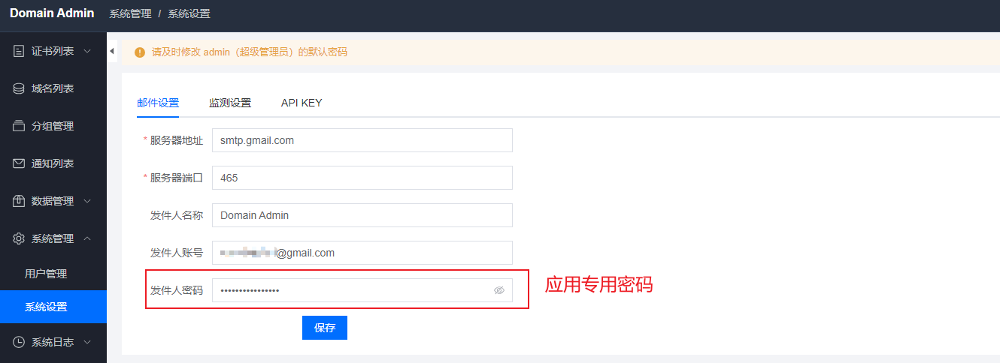
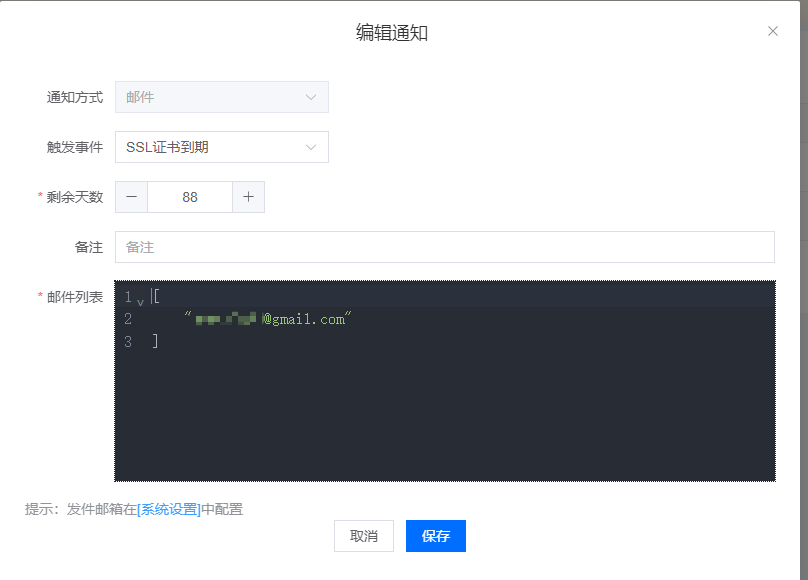
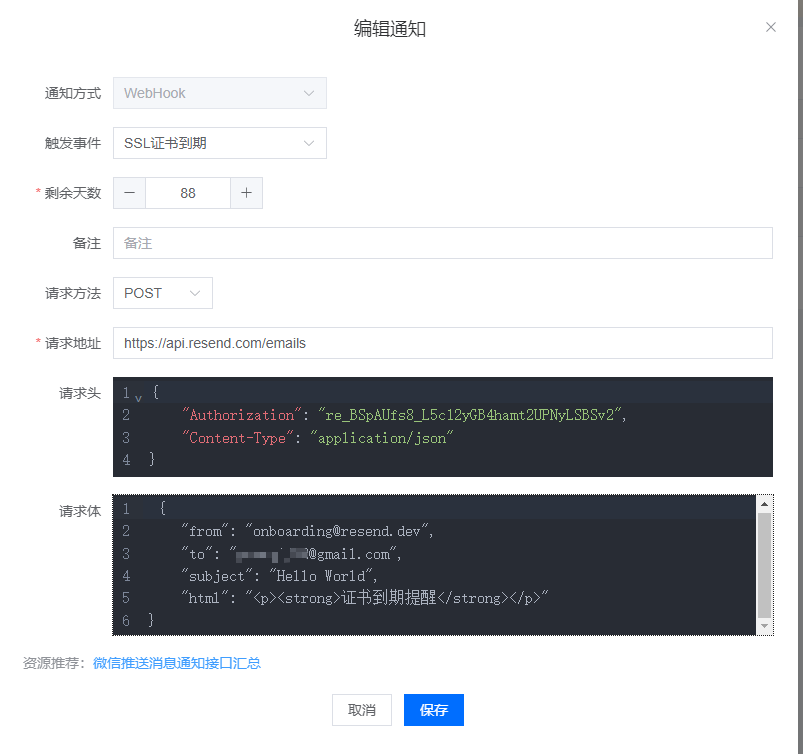

#### docker 部署

```yaml
version: '3'
services:
    domain-admin:
      container_name: domain-admin
      hostname: domain-admin
      image: mouday/domain-admin:latest
      restart: always
      volumes:
        - /etc/localtime:/etc/localtime:ro
        - ./database:/app/database
        - ./logs:/app/logs
      ports:
        - 8000:8000
```


#### nignx配置代理

```
server {
    server_name domains.xxx.top;
    # client_max_body_size 5M;
    charset UTF-8;
    autoindex off;

    access_log  /var/log/nginx/domains.xxx.top.access.log;
    error_log  /var/log/nginx/domains.xxx.top.error.log;
    
    #root /web/agent-vue;
    try_files $uri $uri/ /index.html;
    index index.html index.htm;
 
    #add_header Content-Type "application/json";      
    
    error_page   500 502 503 504  /50x.html;
    location = /50x.html {
        root   html;
    }

    location  / {
       proxy_set_header Host $http_host;
       proxy_set_header X-Real-IP $remote_addr;
       proxy_set_header REMOTE-HOST $remote_addr;
       proxy_set_header X-Forwarded-For $proxy_add_x_forwarded_for;
       proxy_pass http://127.0.0.1:8000;
    }


    listen 443 ssl; # managed by Certbot
    ssl_certificate /etc/letsencrypt/live/domains.lyibyevuee.top/fullchain.pem; # managed by Certbot
    ssl_certificate_key /etc/letsencrypt/live/domains.lyibyevuee.top/privkey.pem; # managed by Certbot
    include /etc/letsencrypt/options-ssl-nginx.conf; # managed by Certbot
    ssl_dhparam /etc/letsencrypt/ssl-dhparams.pem; # managed by Certbot
}

server {
    if ($host = domains.xxx.top) {
        return 301 https://$host$request_uri;
    } # managed by Certbot


    server_name domains.xxx.top;
    listen 80;
    return 404; # managed by Certbot


}
```


#### 邮件通知



```
smtp.gmail.com
465
```




#### webhook to resend邮件




```
{
    "Authorization": "re_BSpAUfs8_L5c12yGB4hamt2UPNyLSBSv2",
    "Content-Type": "application/json"
}
```

```
 {
    "from": "onboarding@resend.dev",
    "to": "xxx@gmail.com",
    "subject": "Hello World",
    "html": "<p><strong>证书到期提醒</strong></p>"
}
```


#### 其他

[使用应用专用密码登录](https://support.google.com/mail/answer/185833?hl=zh-Hans&sjid=16127919763273424415-AP)

[通过其他电子邮件平台查看 Gmail](https://support.google.com/mail/answer/7126229?visit_id=638316558490434134-931634737&hl=zh-Hans&rd=1#zippy=%2C%E7%AC%AC-%E6%AD%A5%E5%9C%A8%E7%94%B5%E5%AD%90%E9%82%AE%E4%BB%B6%E5%AE%A2%E6%88%B7%E7%AB%AF%E4%B8%AD%E6%9B%B4%E6%94%B9-smtp-%E5%92%8C%E5%85%B6%E4%BB%96%E8%AE%BE%E7%BD%AE)

[用电报telegram接收及回复Gmail邮件](https://zvv.me/z/2024.html)

#### 文档

```
https://domain-admin.readthedocs.io/zh_CN/latest/index.html
```

