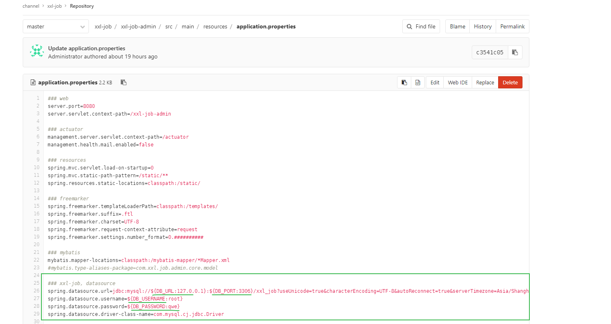
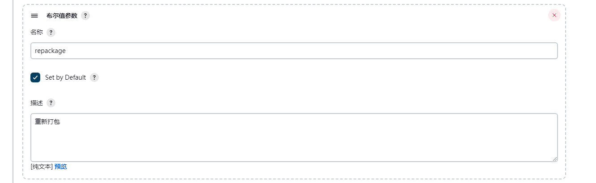
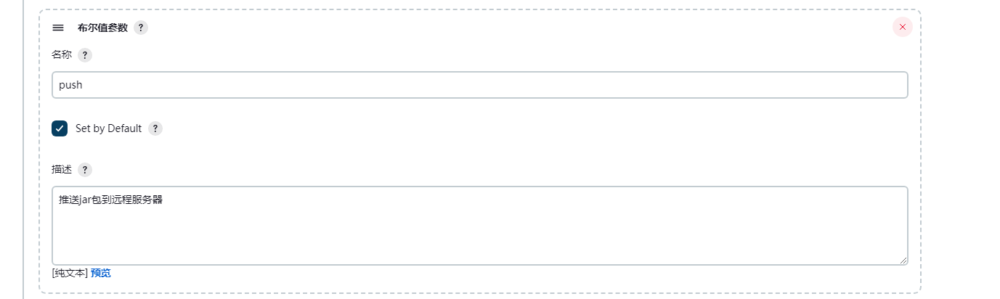
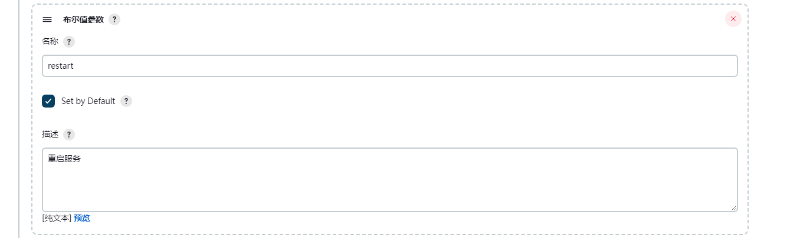
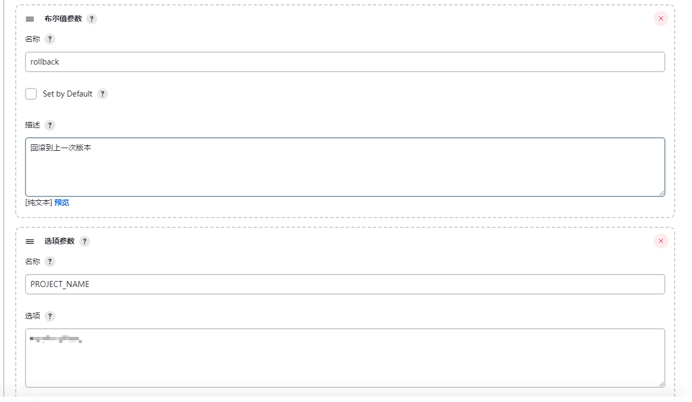
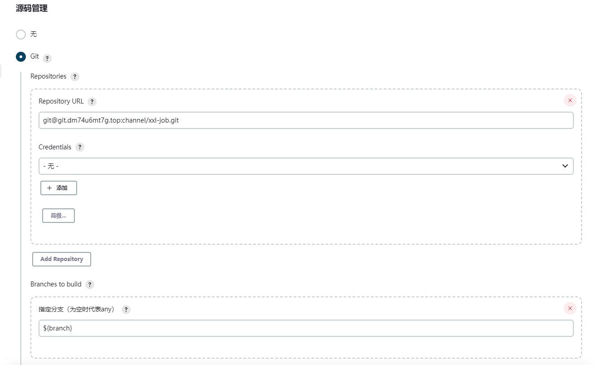

#### 1 开源地址

[分布式任务调度平台XXL-JOB](https://www.xuxueli.com/xxl-job/#2.1%20%E5%88%9D%E5%A7%8B%E5%8C%96%E2%80%9C%E8%B0%83%E5%BA%A6%E6%95%B0%E6%8D%AE%E5%BA%93%E2%80%9D)

github地址

```
https://github.com/xuxueli/xxl-job/tree/master
```

#### 2 构建仓库

拉取代码并推送到自己建立的仓库（如gitlab）

#### 3 修改配置

修改配置文件**application.properties**



```
${DB_URL:127.0.0.1}
${DB_PORT:3306}

${DB_USERNAME:root}
${DB_PASSWORD:qwe}
```


#### 4 Jenkins构建

##### 参数化构建








##### 源码管理



##### 执行shell

```
#!/bin/bash -lex

SERVICE_CONFIG_TABLE='
xxl-job-admin;1.1.1.1
'

if $repackage; then
	echo "# --------------------------- 重新打包 start ------------------------------- #"
		/usr/local/maven/bin/mvn clean package
    echo "# --------------------------- 重新打包 end ------------------------------- #"
fi

if $push; then
    echo "# --------------------------- 推送jar包到远程服务器 start ------------------------------- #"
    for SERVICE_CONFIG in $SERVICE_CONFIG_TABLE; do
    	# 遍历获取每一行的服务名：
        SERVICE_NAME=$(echo $SERVICE_CONFIG | cut -f 1 -d ';' )
        SERVER_IP=$(echo $SERVICE_CONFIG | cut -f 2 -d ';' )
        
    	# 如果 项目名 == 服务名，或者 项目名 == all，二者满足一个条件，则执行推送脚本到远程服务器：
        if [[ "$PROJECT_NAME" == "$SERVICE_NAME" || "$PROJECT_NAME" = "all" ]]; then
            # 备份远程服务器中，原来的jar包到同等目录下，并重命名为${SERVICE_NAME}.jar.bak
            echo "备份${SERVICE_NAME}.jar 为 ${SERVICE_NAME}.jar.bak"
            #ssh root@$SERVER_IP "/usr/bin/cp -f /projects/${SERVICE_NAME}.jar /projects/${SERVICE_NAME}.jar.bak 2>/dev/null"
            
            echo "推送到远程服务器"
            scp $SERVICE_NAME/target/${SERVICE_NAME}*.jar root@$SERVER_IP:/projects/xxl-job/xxl-job-admin-SNAPSHOT.jar
    	fi
    done
    echo "# --------------------------- 推送jar包到远程服务器 end ------------------------------- #"
fi

if $restart; then 
	echo "# --------------------------- 重启服务 start ------------------------------- #"
	for SERVICE_CONFIG in $SERVICE_CONFIG_TABLE; do
    	SERVICE_NAME=$(echo $SERVICE_CONFIG | cut -f 1 -d ';' )
        SERVER_IP=$(echo $SERVICE_CONFIG | cut -f 2 -d ';' )
    	
        # 如果 项目名 == 服务名，或者 项目名 == all，二者满足一个条件，则在远程服务器执行重启服务命令：
        if [[ "$PROJECT_NAME" == "$SERVICE_NAME" || "$PROJECT_NAME" = "all" ]]; then
            ssh root@$SERVER_IP "supervisorctl restart $SERVICE_NAME"
            sleep 5s
    	fi
    done
    echo "# --------------------------- 重启服务 end ------------------------------- #"
fi

if $rollback; then
	echo "# --------------------------- 回滚服务 start ------------------------------- #"
	for SERVICE_CONFIG in $SERVICE_CONFIG_TABLE; do
    	SERVICE_NAME=$(echo $SERVICE_CONFIG | cut -f 1 -d ';' )
        SERVER_IP=$(echo $SERVICE_CONFIG | cut -f 2 -d ';' )
    	
        # 如果 项目名 == 服务名，或者 项目名 == all，二者满足一个条件，则在远程服务器执行回滚并重启服务命令：
        if [[ "$PROJECT_NAME" == "$SERVICE_NAME" || "$PROJECT_NAME" = "all" ]]; then
            # 使用旧的备份覆盖现在的Java服务：
            ssh root@$SERVER_IP "/usr/bin/mv -f /projects/${SERVICE_NAME}.jar.bak /projects/${SERVICE_NAME}.jar"
            # 重启服务：
            ssh root@$SERVER_IP "supervisorctl restart $SERVICE_NAME"
            sleep 5s
    	fi
    done
    echo "# --------------------------- 回滚服务 end ------------------------------- #"
fi
```


#### 5 服务器进程守护配置

/etc/supervisord.d/xxljob.ini

```
[program:xxl-job]
user=root
directory=/projects/xxl-job

command=/usr/local/jdk_1.8/bin/java  -Xms1g  -Xmx1g -jar -Dserver.port=7777 /projects/xxl-job/xxl-job-admin-SNAPSHOT.jar
environment=DB_URL="172.26.143.232",DB_PORT="53306",DB_USERNAME="root",DB_PASSWORD="ZwzseHJJtpfbrCrh"

autostart=true
autorestart=false
startsecs=1
stdout_logfile=/tmp/xxl-job.log
redirect_stderr = true
stdout_logfile_maxbytes = 20MB
stdout_logfile_backups = 5
```

